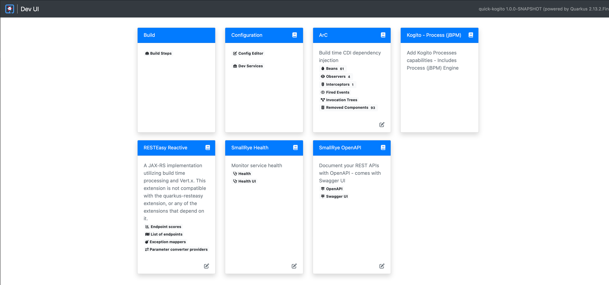
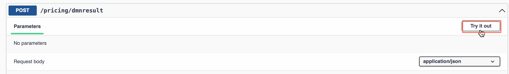
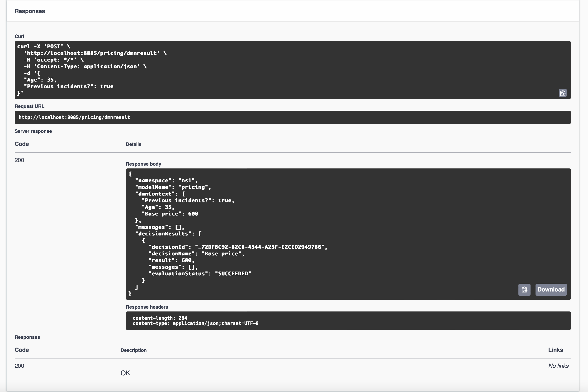

# Deploying the Project locally as a Quarkus runtime

Now that we have seen a little of the DMN Decision, let's use the combined power of Quarkus ([Learn more here about the Kubernetes-native Java Stack that is the best place for Kogito to run!](https://developers.redhat.com/learn/quarkus)) and Kogito to quickly build and deploy the service using Maven commands and also having the option to deploy it to OpenShift as well.

1. The first thing we're going to do is open a terminal (either in VSCode or whatever method you prefer) and validate that you have Maven and Java installed.

    ~~~bash
    java -version
    ~~~

    *Expected output should be similar to*

    ~~~console
    openjdk version "11.0.11" 2021-04-20
    OpenJDK Runtime Environment AdoptOpenJDK-11.0.11+9 (build 11.0.11+9)
    OpenJDK 64-Bit Server VM AdoptOpenJDK-11.0.11+9 (build 11.0.11+9, mixed mode)
    ~~~

    ~~~bash
    mvn -version
    ~~~

    *Expected output should be similar to:*

    ~~~console
    Apache Maven 3.8.6 (84538c9988a25aec085021c365c560670ad80f63)
    Java version: 18.0.2, vendor: Homebrew, runtime: /opt/homebrew/Cellar/openjdk/18.0.2/libexec/openjdk.jdk/Contents/Home
    Maven home: /opt/homebrew/Cellar/maven/3.8.6/libexec
    Default locale: en_US, platform encoding: UTF-8
    OS name: "mac os x", version: "12.6", arch: "aarch64", family: "mac"
    ~~~

1. Now that our environment is has the appropriate resources, let's build and run the service locally. Quarkus does this very simply with the command `mvn quarkus:dev` which will operate the container in development mode. By default it will run on 2 ports when running this command, `8080` and `5005`. These ports can be maintained in the `application.properties` file in `src/main/resources/` or you can modify the `mvn quarkus:dev` command to load those properties from the command line. If you want to do the command line, you can do `mvn quarkus:dev -Dquarkus.http.port=8085 -Ddebug=7007` which would setup your application to run off of port `8085` and be able to attach a remote debugger at `7007`. To change the default host in application.properties add the following line.

    ~~~java
    quarkus.http.port=8085
    ~~~

1. After the project's application.properties has been updated, let's start the Quarkus service by running the following command. This command will run the remote debugger (which we are not using in these labs) on port 6006 so that if you already have another application running on 5005 (the default port) it won't give an error.

    ~~~shell
    mvn quarkus:dev -Ddebug=6006
    ~~~

1. When the service is ready, it will produce a log similar to the below:

    ~~~log
    $ quick-kogito % mvn quarkus:dev -Ddebug=6006
    [INFO] Scanning for projects...
    [INFO] 
    [INFO] --------------------< com.ibm.sample:quick-kogito >---------------------
    [INFO] Building quick-kogito 1.0.0-SNAPSHOT
    [INFO] --------------------------------[ jar ]---------------------------------
    ...
    2022-09-29 20:48:34,404 INFO  [org.kie.kog.cod.dec.DecisionValidation] (build-23) Initializing DMN DT Validator...
    2022-09-29 20:48:34,405 INFO  [org.kie.kog.cod.dec.DecisionValidation] (build-23) DMN DT Validator initialized.
    2022-09-29 20:48:34,405 INFO  [org.kie.kog.cod.dec.DecisionValidation] (build-23) Analysing decision tables in DMN Model 'pricing' ...
    2022-09-29 20:48:34,410 INFO  [org.kie.kog.cod.dec.DecisionValidation] (build-23)  analysis for decision table 'Base price':
    2022-09-29 20:48:34,412 INFO  [org.kie.kog.cod.dec.DecisionValidation] (build-23)   Decision Table Analysis of table 'Base price' finished with no messages to be reported.
    2022-09-29 20:48:34,494 INFO  [org.kie.kog.qua.com.dep.KogitoAssetsProcessor] (build-38) reflectiveEfestoGeneratedClassBuildItem org.kie.kogito.quarkus.common.deployment.KogitoGeneratedSourcesBuildItem@415815e1
    __  ____  __  _____   ___  __ ____  ______ 
     --/ __ \/ / / / _ | / _ \/ //_/ / / / __/ 
     -/ /_/ / /_/ / __ |/ , _/ ,< / /_/ /\ \   
    --\___\_\____/_/ |_/_/|_/_/|_|\____/___/   
    2022-09-29 20:48:35,728 INFO  quick-kogito 1.0.0-SNAPSHOT on JVM started in 2.432s. 
    2022-09-29 20:48:35,728 INFO  Listening on: http://localhost:8085
    2022-09-29 20:48:35,728 INFO  Profile dev activated. Live Coding activated.
    2022-09-29 20:48:35,728 INFO  Installed features: [cdi, kogito-decisions, kogito-predictions, kogito-processes, kogito-rules, resteasy-reactive, resteasy-reactive-jackson, smallrye-context-propagation, smallrye-openapi, swagger-ui, vertx]
    ~~~

## Using the project that is created

Now that your application is created, you can start using it more for live development and change as you go.

1. To access the Quarkus Development console, in the logs, you can `Command/Ctrl+click` the link in VSCode or go to ()[http://localhost:8085], directly.

    

1. The development console will show various aspects of your deployment. A quick highlight will be:

    - The list of end points that are available
    - The produced Maven artifact name (in this case quick-kogito 1.0.0-SNAPSHOT)
    - You can modify configurations of your running application from here
    - The Swagger UI and OpenAPI pages to get more information and test out your end points.
 
    We will be clicking the Swagger UI link to open the Swagger page to try out our sample DMN.
 
    

1. Here you can see your generated Quarkus endpoints that deal with the Decision model. When building a DMN Decision Service with {{ product.name }} in Kogito, it will be able to use the DMN Model, coupled with the data model created in it to generate the required end points and inputs. This creates a **Domain Specific Decision Service**, which is different than how KIE Server worked before in that you would interact with a generic API and insert the objects for execution. By going away from the classpath loading strategy in Kogito, Decision Services are ready to be deployed into a cloud native environment. Your payloads are simpler and easy to reuse across any services as required without having to know exactly how the service is deployed, the objects associated with the deployment and more.

    

1. The service that was created for the Decision Service is called **Pricing Resource** and if you click any of the end points you will get more information on them. The first end point to look at is the `Post /pricing`. This endpoint can be used to execute a decision and return just the data associated with the decison (inputs and outputs).

    

1. After clicking, you can edit the Domain Specific payload in input that matches your decision input nodes (`Age` and `Previous incidents`) with values you want to test. Notice that the endpoints use faces in the object names, this matches the expected values that were tied to the inputs in the model as opposed to camelCase or snake_case or PascalCase. This helps with a consistent view across the Kogito stack - from design to runtime.

    

1. Your result should look similar to the one below. As you can see, the Swagger-UI page produces a few things of note, the first being a Curl command to reproduce locally, the URL you called, and then ultimately the response from the service.

    

1. The next endpoint to evaluate is the `/pricing/dmnresult` endpoint which will tell you more about the decision that executed. You can use the same payload from the previous steps to show the differences of what is presented. That payload can be similar to the code below provided in JSON. Click `Try it out` and repeat the steps from above. 

1. The input for the `Try it out` can be used from below.

    

    ~~~json
    {
      "Age": 35,
      "Previous incidents?": true
    }
    ~~~

1. Click `Execute` with the updated payload.

    

1. The result will go into more detail about which Decision Nodes were executed against and more. When there is more than one Decision Node available, you can see the results from each node.

    

Now you can play with the DMN model more and see how those changes impact your Quarkus service. Since you're in Dev mode, as you make changes, those changes should be available to you each time you save. Try it out!
