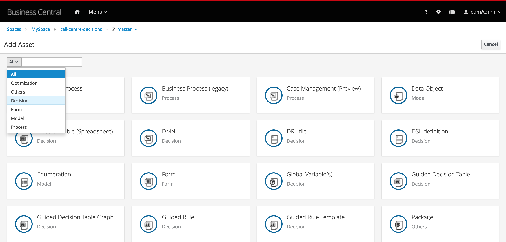

# Vacation Days - Use case and project creation

In this lab you'll try out the combination of DMN decision tables with literal expressions. You will also explore a number of different FEEL constructs and expressions like, for example, ranges. Finally, you'll learn how to use the KIE Java Client to consume decisions.

## Goal

- Implement a DMN model using the Red Hat DM/PAM DMN editor
- Deploy the existing DMN project to Decision Server
- Consume the DMN project using the REST API
- Consume the DMN project using a Java API

## Problem Statement

In this lab we will create a decision that determines the number of vacation days assigned to an employee. The number of vacation days depends on age and years of service.

- Every employee receives at least 22 days.

- Additional days are provided according to the following criteria:

    1. Only employees younger than 18 or at least 60 years, or employees with at least 30 years of service will receive 5 extra days;

    1. Employees with at least 30 years of service and also employees of age 60 or more, receive 3 extra days, on top of possible additional days already given;

    1. If an employee has at least 15 but less than 30 years of service, 2 extra days are given. These 2 days are also provided for employees of age 45 or more. These 2 extra days can not be combined with the 5 extra days.

## Create a Decision Project

To define and deploy a DMN decision model, we first need to create a new project in which we can store the model. To create a new project:

1. Navigate to [Business Central](http://localhost:8080/business-central)

1. Login to the platform with the provided username and password.

1. Click on **Design** to navigate to the Design perspective.

    {:width="600px"}
1. In the Design perspective, create a new project. If your space is empty, this can be done by clicking on the blue **Add Project** button in the center of the page. If you already have projects in your space, you can click on the blue **Add Project** icon at the top right of the page.

1. Give the project the name `vacation-days-decisions`, and the description "Vacation Days Decisions".

    {:width="600px"}

1. With the project created, we can now create our DMN model. Click on the blue **Add Asset** button.

1. In the **Add Asset** page, select **Decision** in the dropdown filter selector.

    {:width="600px"}

1. Click on the **DMN** tile to create a new DMN model. Give it the name `vacation-days`. This will create the asset and open the DMN editor.

    {:width="600px"}

## Next Steps

You can do this lab in 2 ways:

1. If you already have (some) DMN knowledge, we would like to challenge you to build the solution by yourself. After you’ve built solution, you can verify your answer by going to the next module in which we will explain the solution and will deploy it onto the runtime.

1. Follow the next step with contains a step-by-step guide and will guide you through the implementation.
