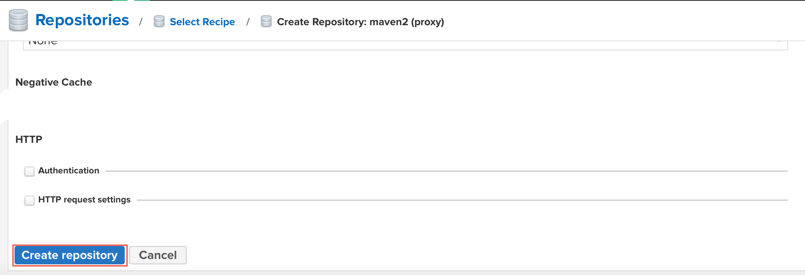
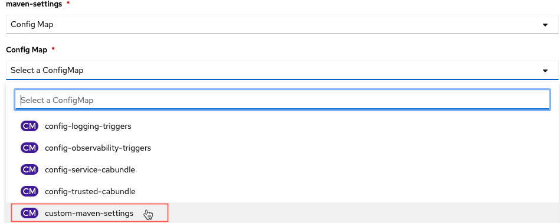

# {{ product.name }} CI/CD Overview

This lab was forked from the KIE Live session delived by Rafael Soares on YouTube found [here](https://youtu.be/AAq8oUvSOUU). This lab has been updated to more current releases and also includes a provisioning of Nexus3 to deploy a Maven Repository in your environment. You do not need to do this if you have a Maven repository you can deploy your artifacts to. This lab will be using the OpenShift provided Pipelines built upon Tekton. With {{ product.name }}, the projects are based on Maven artifact architectures, which provides an easy to build and deploy mechanism for all of your product needs. These can be done in Tekton as seen here, or with your favorite/enterprise provided CI/CD tools.

The project in this lab is a Spring Boot hosted Decision Service that is utilizing the embedded KIE Server that will have a build and deploy triggered through the changes in your code base that are pushed to the specified build branch. With Decision Service projects, it is highly recommended that on all push events you consider a build of the project. This ensures that all the resources that are required are constantly available, breaking changes are identified immediately and if you want to release immediately, it's very easy to do so.

## Lab Overview

Within this lab you will see how you can use OpenShift Pipelines (a.k.a Tekton) to automate the delivery of decision services implemented with {{ product.short }}. In this lab you will see:

- The automation of repeatable decisions using the [DMN](https://www.drools.org/learn/dmn.html) specification;
- Decision tables implementation using XLS.
- Usage of the rules engine based on KIE Server and running on top of SpringBoot
- CI/CD Pipeline implemented using Tekton
- How to configure webhooks in your pipeline to deploy based on changes on a git repository
- Automated tests for decisions (with Test Scenarios ) that are considered during the pipeline execution
- Deployment with zero downtime with OpenShift rolling deployment strategy

## Pre-requisites

- Java 8

- OpenShift 4.10+

- OpenShift Command Line client (`oc`)

- [VSCode](https://code.visualstudio.com/)

- [VSCode Business Automation Extension](https://marketplace.visualstudio.com/items?itemName=redhat.vscode-extension-red-hat-business-automation-bundle)

## Installing on OpenShift

1. Fork this repository, [to get started](https://github.com/timwuthenow/business-automation-cicd-showcase.git).

    

1. Clone your fork to your local machine.

   ~~~ shell
   git clone https://github.com/${yourgithubuser}/business-automation-showcase.git
   cd business-automation-showcase
   ~~~

1. Run the provisioning script (Linux/MacOS):

    ~~~shell
    sh provision.sh
    ~~~

1. When the script runs, you will be presented with a prompt to enter a namespace name, which is the namespace that will be created for your environment to be deployed in.

    ~~~bash
    business-automation-cicd-showcase % ./provision.sh 
    Input a namespace root - first letter lowercase
    namespace: tim-demo
    ~~~

1. When this completes you will get a console with a few links, as well as an admin password to the Nexus environment that was created.

    ~~~text
    ******************************************************************
    
    Use this URL in your GitHub Webhook configuration for automatic deployment
    http://el-ba-cicd-event-listener-tim-demo-rhdm-kieserver-cicd.openshift.io
    
    Use this URL to access the front-end application:                
    http://decision-service-webclient-tim-demo-rhdm-kieserver-cicd.openshift.io
    
    Use this URL to access the Nexus Repository:                
    http://nexus3-tim-demo-rhdm-kieserver-cicd.openshift.io
    
    Use this password for admin access to Nexus 3:                
    long-strung-out-password-used-for-nexus-repo-admin
    
    ******************************************************************
    ~~~

## Configuring the automatic deployment on GitHub

1. To configure the webhook for automated deployment, open your fork in your GitHub. Next, add a new webhook by opening "**Settings** -> **Webhook** -> **Add webhook** button".

   

2. Fill the form with the information below:
   - **Payload URL**:  provided after the provisioning. You can also get it using the command:
    

    ~~~shell
    echo $(oc get route el-ba-cicd-event-listener --template='http://{{.spec.host}}')
    ~~~

    

   - **Content type**: `application/json`
   - **Secret**: empty
   - **Which events would you like to trigger this webhook?**: `Just the push event`.

At this point, you should already have a fully automated integration and deployment lifecycle for the business application. Any changes pushed to your repository will trigger the pipeline in your OpenShift cluster.

## Maven Repository Setup

Typically an environment would already have a Maven repository included, but if you wanted to set one up and use your own, this is a quick run through of what's required to get the Maven Repository to connect to the current location of the {{ product.name }} Maven artifacts which reside in the {{ product.maven }}.

From the console log you got earlier, you would have received two messages with routes and password infromation for the Nexus repository location (the 3rd item) and the admin password (the commands to get these are found within the `provision.sh` file). If you hold Control (Linux/Windows) or Command (Mac) and click the link in VSCode, you will go to the location of your newly provisioned Nexus3 repository.

By default, the Nexus repository includes a Mirror of [Maven Central](https://repo1.maven.org/maven2/) which anyone can publish to following [this documentation](https://maven.apache.org/repository/guide-central-repository-upload.html) and is the typical environment for Community releases, but enterprise releases of Open Source Software can be found here as well. The practice within Red Hat, has been to publish artifacts to its own repository found [here](https://maven.repository.redhat.com/ga/) as these are the enterprise releases and outside of community. No access is required to pull from this repository. We will configure our newly minted Nexus repository to have a Mirror of the {{ product.maven }} so that for any product releases that are used, it will pull them from {{ product.maven }} and publish them in the Nexus repository as a proxy. This is common in most enterprise environments instead of a direct connection to the repositories to offset downtime, have security checks, etc.

To setup the mirrow follow these steps:

1. From the route that was produced from the console output (or you can run `oc get route | grep nexus` where you will need to paste the output) and use that link to get to the Nexus admin screen.
1. From here, using the admin password that was a part of your console output. Click `Sign In`. Alternatively the command to run is below.

    ~~~bash
     echo "$(oc exec $(oc get pod -o template --template '{{range .items}}{{.metadata.name}}{{"\n"}}{{end}}' | grep nexus) -- cat /nexus-data/admin.password)"  
    ~~~

    

1. Copying the password, login as `Admin` with the password from the previous command.
   

1. You will now have a Wizard popup to walk you through some setup, we're going to do very minimal changes: you can change the password (e.g. `password`). Typically in this development/throwaway environment, enabling anonymous access is the best way to do this, so select that option `Enable anonymous access`. Then click finish.

    {:width=50%}

    {:width=50%}

1. Now that the repository is ready to be configured, we are going to create a mirror of the {{ product.maven }} so that we can pull resources through the proxy instead of direct. To do this, click the Gear icon (:octicons-gear-16:) to open the settings screen.
    

1. From here click `Repositories` to view the current repositories and also to be able to create another.
    

1. Here you will see a list of default repositorues. By default, Nexus will include the connection to _Maven_Central_, but we'd also like to add the {{ product.maven }} connection to pull the resources from this repository. To do so, click `Create Repository` to build a new repository.
    

1. Scroll down and we're going to create a `maven2 (proxy)`. The reason we're doing a proxy is that we're going to allow our repository to reach out to the {{ product.maven }} to retrieve artifacts it does not already have, but if it has previously pulled them, will be stored in the Nexus repository's cache. This way if there are new releases, you can pull as required, but are not taking the entire repository as required.
    ")

1. On the form that opens, you will add the following information (the name red_hat_ga needs to be exact to match the lab expectations):
   - _Name_: `red_hat_ga`
   - _What type of artifacts does this repository store_: `Release`
   - _Remote Storage_: `https://maven.repository.redhat.com/ga`

    

1. Click `Create repository` at the bottom to deploy the proxy instance of the {{ product.maven }}

    

1. Your repositories should now be setup and look similar to the below.

    

## First run of the Pipeline to configure Persistent Volume Claims for the workspaces

With the first run of the pipeline, you may have to run the pipeline manually. To do so, login to the OpenShift console for your project. You can see the console URL by running `oc whoami --show-console` and that will return the console link, Command/Control click it to open from VS Code.

Once logged in, make sure to go to our project that you created in the `provision.sh` script. Follow these steps to run the pipeline for the first time.

1. Make sure you change your project to the one you created in `provision.sh`. From the cluster home page, you can click `Pipelines` and then click `Pipelines`

    

1. From the Pipelines screen, confirm your namespace matches what you created in the first part of the lab and after that, click the _kebab_ icon to open the menu to `Start Pipeline`.

    

1. Once you click start pipeline, a form will come up to set some settings for the pipeline. These should only have to be the first time you run this pipeline. You will modify the ones below if you followed the previous section for the workspaces to align to the ConfigMap of `settings.xml` used by Maven to build and the Persistent Volumes used for workspace data (git clones and the Maven artifacts).

   - _maven-local-repo_: click the dropdown menu and select `PersistentVolumeClaim` and in the _Select a PVC_ dropdown that appears, select `maven-repo-pvc`

    

   - _maven-settings_: click the drop down and select `Config Map` and select from the new dropdown `custom-maven-settings`

    

   - _shared-workspace_: click the dropdown menu and select `PersistentVolumeClaim` and in the _Select a PVC_ dropdown, select `source-workspace-pvc`

    

   - With this complete you can click the `Start` button to begin the pipeline

    

## Testing GitHub and Pipeline integration

If you run this test, a new deployment should be triggered. The pipeline will deploy the decision service for the first time.

1. In your terminal, access your project folder.

2. Commit and push. You can use this empty commit sample if you need:

   ~~~shell
   git commit -m "an empty commit to test the pipeline" --allow-empty
   git push origin master
   ~~~

3. In OpenShift, access: "**Pipelines** -> **ba-cicd-pipeline** -> **Pipeline Runs** " and check the progress of your application deployment.
    

## Using the web application

The web application allows you to interact with the deployed rules and decisions in a specific Decision Server (KieServer or Kogito runtime). To use the deployed web app to interact with the deployed decisions, first you need to set the KIE Server URL in the web app settings.

1. The deployed decision service is now deployed and accessible. Get your deployed KIE Server route. You can use the command:
    

    ~~~shell
    echo "http://"$(oc get route business-application-service-route -n rhdm-kieserver-cicd | awk 'FNR > 1 {print $2}')"/rest/server"
    ~~~

    

2. Open your web application. The URL was provided in the installation step. If you lost it, use the command
   

   ~~~shell
   oc get route decision-service-webclient --template='http://{{.spec.host}}' -n rhdm-kieserver-cicd
   ~~~

   
3. In the web application, click on the settings icon on the top right corner. In the field `Kie Server Base URL`, insert KIE Server URL.
4. You can use the "Test Connection" button to validate the communication between the two services, then Save.
5. You should be able to test the available decisions and rules.

With this, the whole demo is now set up and ready to use.

> NOTE: If you get interested in see how this webapp was developed the src code is available [here](https://github.com/rafaeltuelho/decision-service-webclient)

## Extra information

The provisioning script `provision.sh` will:

- Create a new namespace called rhdm-kieserver-cicd
- Install OpenShift Pipelines
- Create the pipeline resources
- Deploy a front-end application that you can use to interact with the decision service once you deploy it.

At the moment there are 4 projects in this repository:

- [decisions-showcase](decisions-showcase/): Decision use cases using Business Rules (Drools) and Decision Logic (DMN)
- [business-application-service](business-application-service/): Spring Boot runtime based Kie Server exposing the API for Decisions provided with this Showcase demo
- [cicd](cicd/): Tekton Pipeline resources to implement a fully automated CI/CD pipeline for your Business Application Services
- [monitoring](monitoring/): working in progress...

To see a detailed instruction on each service and each deployment processes (with images), check:

- [Provisioning and testing the CI/CD Pipeline](cicd/readme.md)
- [Provisioning and testing the webclient application](https://github.com/rafaeltuelho/decision-service-webclient/blob/main/README.md)

### Interested in Kogito?

Check out the [kogito-quarkus](https://github.com/jbossdemocentral/business-automation-cicd-showcase/tree/kogito-quarkus) branch to see this same demo but using Kogito based Decision Services instead of KieServer.
