# Getting started with {{ product.short }}

This guide shows you the experience of using {{ product.name }} to author, deploy, and execute your business automation applications. With three steps, this guide will get you from installation to deployment and testing of a business application:

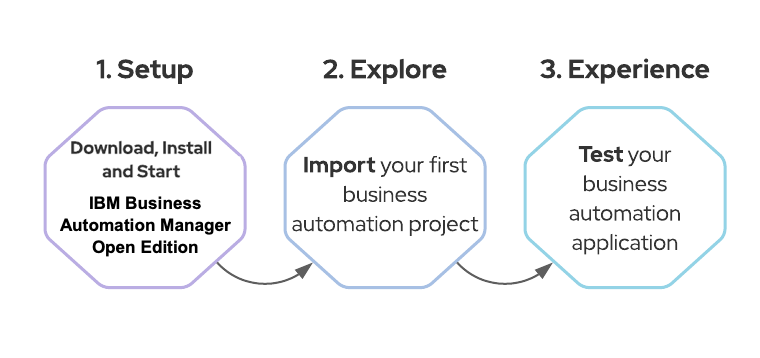

We will install {{ product.short }} locally, and it will run on top of Red Hat JBoss EAP (a.k.a. WildFly). Once we have it up and running, we will import an existing application, so that we have an overview of some capabilities by exploring the tool and the project itself. Finally, we'll wrap up by deploying the project and testing it. 

## Pre-requisites

We expect you to have installed in your machine:

* Java JDK 11 ( if you don't have it yet, you can download OpenJDK built by Red Hat https://developers.redhat.com/openjdk-install )
* GIT client (https://git-scm.com/)
* *{{ product.name }} Installation Demo*:
  **NOTE**: You should use this installer to quickly install EAP, PAM and pre-configure the environment and user access you'll need.
  `$ git clone https://github.com/timwuthenow/ibamoe-docker.git`

You should now have successfully installed {{ product.name }}.

You have two key components deployed in your Red Hat EAP right now: **Business Central** and **KIE Server**. 

**Business Central** is the component that allows you to develop business assets like processes and decisions, to manage projects, build and package them. Finally, you can deploy it in KIE Server.

**KIE Server** is a lightweight engine capable of executing business assets like processes, cases and decisions. It can be easily integrated with your services, for example via REST or JMS.

Luckily, {{ product.name }} comes with a number of out-of-the-box template and example applications that can be used to quickly build and deploy a process microservice.

## Explore the Asset

Let's start by accessing Business Central.

1. In your browser, access Business Central by navigating to http://localhost:8080/business-central
1. Log in with the credentials:
   1. User: **bamAdmin**
   1. Password: **ibmpam1!**

1. Click on "Design, create and modify projects and pages"

1. Select "MySpace", and next, click on "Import Project":

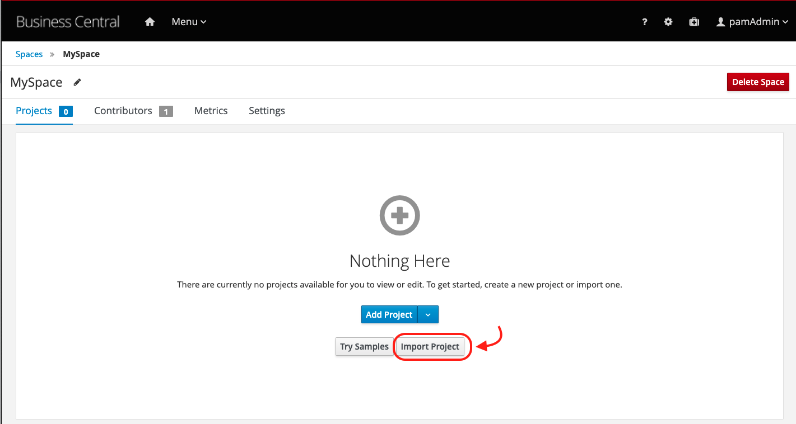

1. Insert the following repository URL, and click on Import.
https://github.com/jbossdemocentral/rhpam7-order-management-demo-repo.git

1. Select the Order-Management project and click on OK.

1. Once the project has been imported, notice it has 27 assets. Click on the filter button "All" and select Process.

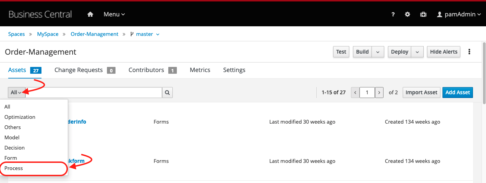

1. Open the order-management process. This is the automated process that determines the approval or denial of an order request. As you see below, it is implemented with the BPMN2 standard.

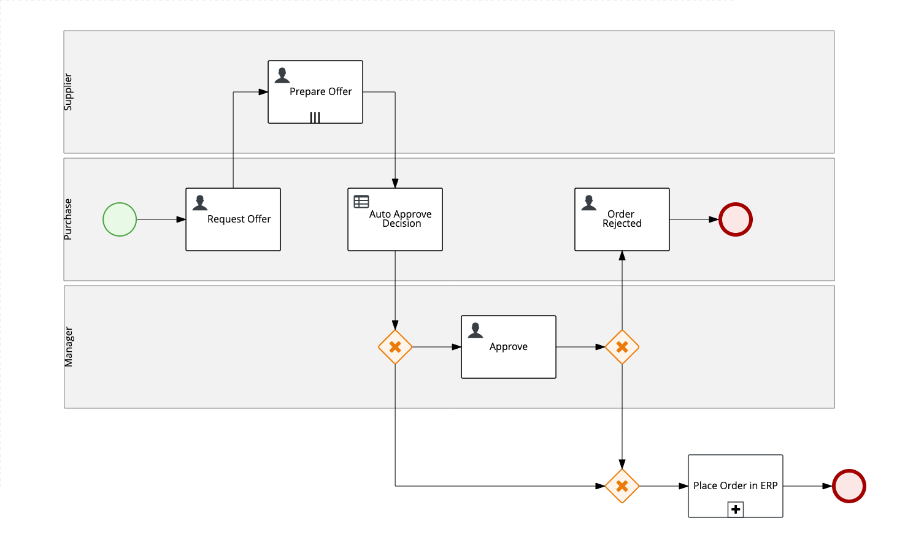

1. The final element of this process, is a sub-process "Place Order in ERP". This subprocess includes advanced bpmn2 modeling concepts like compensation and event based gateways. Have in mind that PAM supports the modeling of advanced flows using the bpmn2 specification, but don't worry if you don't fully get what is happening in this subprocess.

1. Notice this process tasks are aggregated in three lanes: Manager, Purchase and Supplier. The approval decision will be made based on multiple authors, but, in this process we even have the support of automated decision. The automated decision is made on the node "Auto Approve Decision", that references a DMN Model that is also part of this business project.

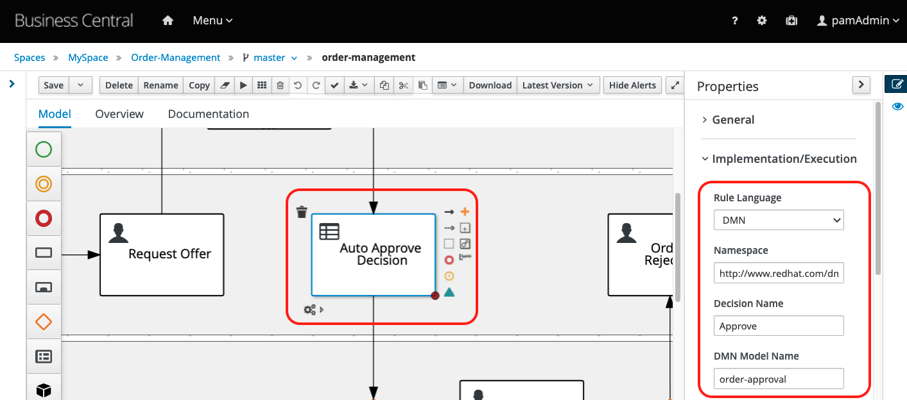

1. Close the process modeler. Now, filter the assets by Decision. You should see a Test Scenario and a DMN model.

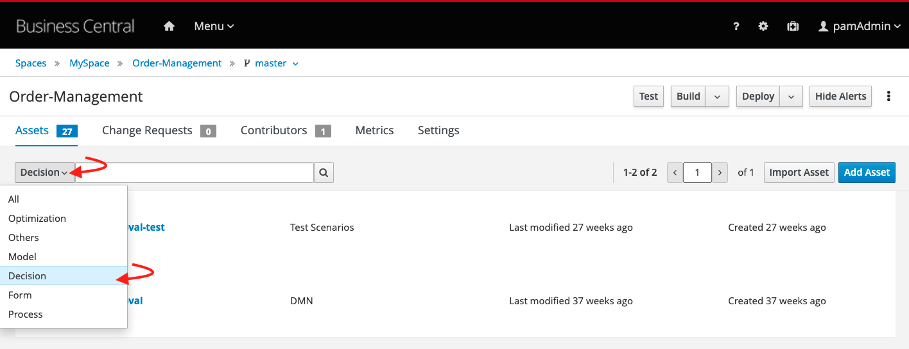

1. Open the order-approval. It is a simple decision model that can define the "Approve" decision based on the data input "Order Information" and on the "Price Tolerance" business rules.

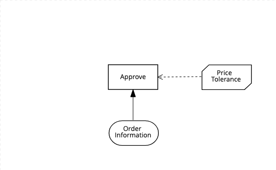

1. Now, close the decision asset. In your project page, click on the Deploy button. Business Central will trigger the build of this maven project, that will be packaged in a KJAR (the deployment unit which contains the assets) and will be deployed on the KIE server.

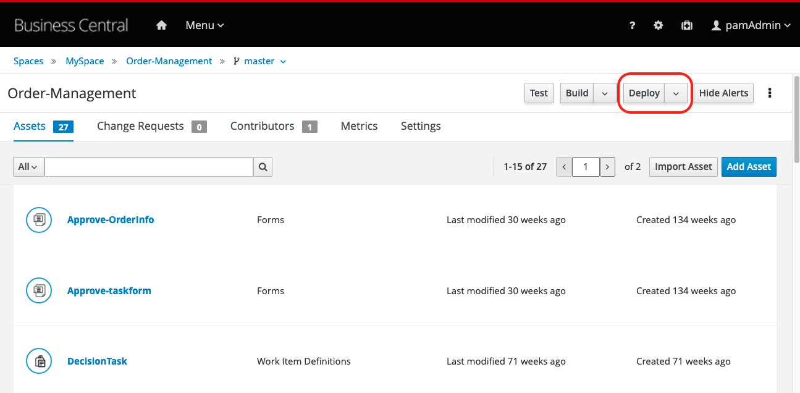

1. Once the build and deployment has finished, you'll see a successful deployment message. Click on the "View deployment details" link.

1. The page will show a running “default-kieserver” with the “order-management_1.1-SNAPSHOT” container deployed.

Our business project is now available to be consumed by client applications! Let's have a look at how we can consume this business application.

## Experience

The engine, KIE Server, is the service which exposes the business project and also the one we use when integrating with client applications. It comes with a Swagger UI that allows us to test the RESTful endpoints of the engine and consume rules deployed on it. 

Another way to consume our business project is to use Business Central UI to interact with the engine and test our business assets.

For this hello world, let's use Business Central process and task management capabilities.

1. In Business Central, let's open the Menu in the top bar and navigate to "Process Definitions"
    
1. We can see three different process definitions. We'll start a new process instance based on the "order-management" process. Click on the actions kebab, and select "Start"
    
1. The form that opened is also part of our business process and we can customize it if needed. For now, let's just fill in the data required to start our process instance, and click the "Submit" button.
   * Item Name: Laptop Dell XPS 15
   * Urgency: Medium
    
1. A new process instance will start in the engine. In order to visualize the current status, click on "Diagram".
    
1. Notice we currently have a Human Task named "Request Offer" waiting for human intervention. Now, let's work on this task. In the Menu, access the "Task Inbox":
    
1. In the list you should see a list of tasks you have permission to see and work on. Let's claim the Request Offer task to our user, and start working on it. Click on the kebab and select the "Claim and Work" option: 
    
1. You'll see the task data available for your analysis, as a knowledge worker - someone responsible for executing the task. 
1. Click on the blue "Start" button to start working on the task.Based on this offer, we'll define our reply. Inform the following data and click on the blue "Complete" button:
   * Category : optional
   * Target Price: 250
   * Suplier list: supplier 1
    
1. According to our process, a new task will be created for the suppliers. The supplier should provide an offer - so let's do it. Still on the task list, claim and work the task "Prepare Offer":
    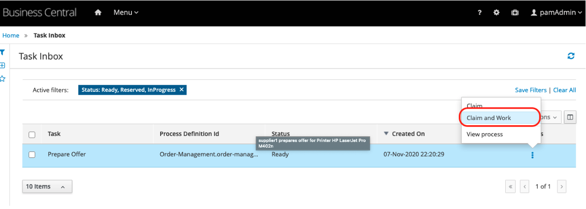
1. Click "Start" blue button, inform any date, and the best offer as **1000**. Click on complete.
    
1. At this point, the automatic approval was already taken, and our request was not automatically approved. You can confirm this by visualizing the process instance. On the kebab, select "View Process"
    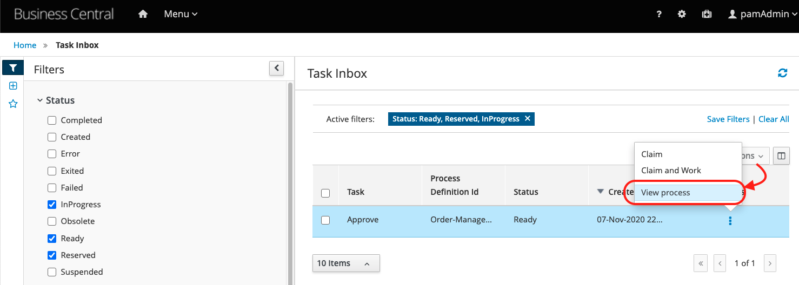
1. You'll be redirected to the list of process instances. Select the process instance with id 1, and then, choose the "Diagram" option:
    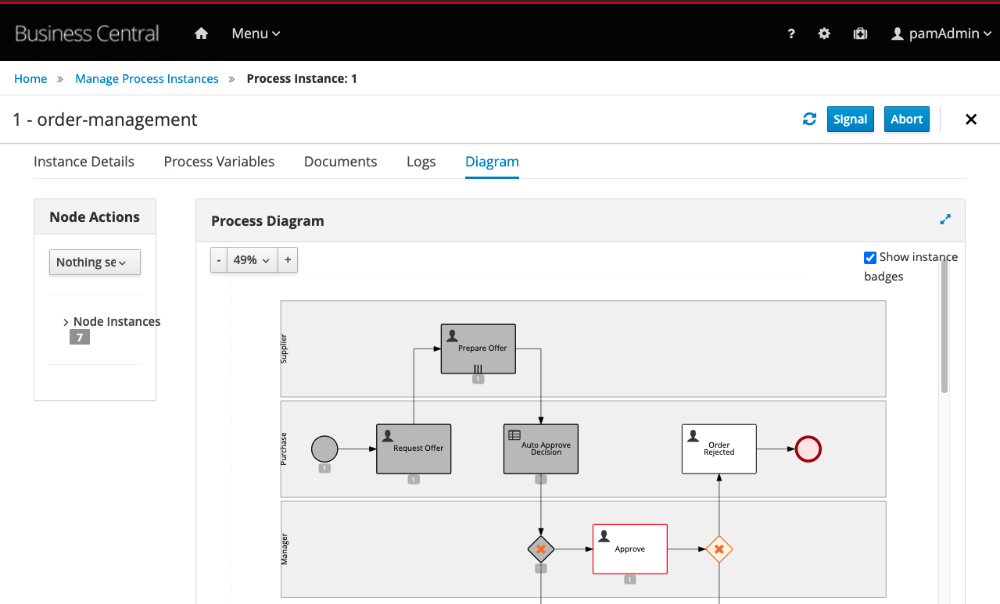

At this point, you have learned how you manage processes and tasks using Business Central. You know how to start new process instances, how to interact with the process tasks and how to complete them.

What about finishing this process by your own? Following the same idea, In Business Central, you can reprove the request, reject the order and reach the end of this process instance.

## Conclusion

Congratulations, you successfully concluded a Hello World in {{ product.name }}.

In this guide, we installed Red Hat PAM, imported a project directly from GitHub, checked out the a process definition modeled and an automation decision.

We wrapped up our tutorial by deploying and testing our services using Business Central UI. If you want to know more about the Order Management demo, we recommend you take a look at the project's instructions at the github repository located [here](https://github.com/jbossdemocentral/rhpam7-order-management-demo-repo).
