## Create a Project

To define and deploy a business process, we first need to create a new project in which we can store the BPMN2 model, our domain model and the forms required for user interaction. To create a new project:

1. Navigate to [Business Central](http://localhost:8080/business-central)
1. Login to the platform with the provided username and password.
1. Click on **Design** to navigate to the Design perspective.

    

1. In the Design perspective, create a new project. If your space is empty, this can be done by clicking on the blue **Add Project** button in the center of the page. If you already have projects in your space, you can click on the blue **Add Project** icon at the top right of the page.
1. Give the project the name `order-management`, and the description "Order Management".

    

With the project created, we can now start building our solution.

## Lab Walk through

In this section we will first create the Domain Model within Business Central and then walk through the creation of the assets associated with the Process.

### The Domain Model

The business process will collect and carry data through the execution of the process. This data is stored in a data model or domain model. In this lab, we collect two types of data:

- `OrderInfo`: contains information about the order, like the item and the price.
- `SupplierInfo`: contains information about the supplier, like the name and the expected delivery date.

---------------

 1. In your project, click on the *Add Asset* button in the middle of the screen.

    

 1. In the drop-down menu in the upper-left corner, select `Model`. Click on the *Data Object*
   tile.

    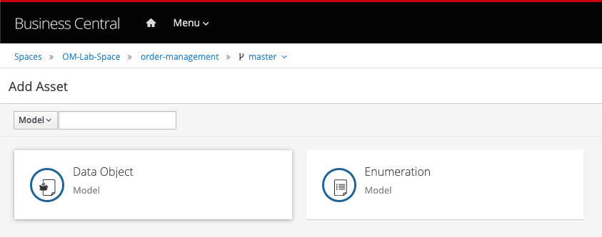

 1. Give the *Data Object* the name `OrderInfo`. Leave the package set to default.

    

 1. Add the following fields to the `OrderInfo` data object:

      | Identifier      | Label        | Type    |
      |-----------------|--------------|---------|
      | item            | item name    | String  |
      | urgency         | urgency      | String  |
      | targetPrice     | target price | double  |
      | managerApproval | approved     | Boolean |

 1. When you’ve added the fields, save the data object by clicking on the *Save* button in the top menu.
 1. Use the \_breadcrumb\` navigator at the top-left of the screen to navigate back to our `order-management` project.
 1. Click on the blue *Add Asset* button in the top-right corner and create a new *Data Object*
 1. Give it the name `SupplierInfo`

    

 1. Give the `SupplierInfo` object the following fields:

      | Identifier   | Label         | Type   |
      |--------------|---------------|--------|
      | offer        | best offer    | double |
      | deliveryDate | delivery date | Date   |
      | user         | user          | String |

 1. We’re done creating our data model.

    

We can now start with our process design.

---------------

## Process Design

With the domain model defined, we can now sketch out the main flow of the process, the actors, the user task nodes and the required automation decisions.

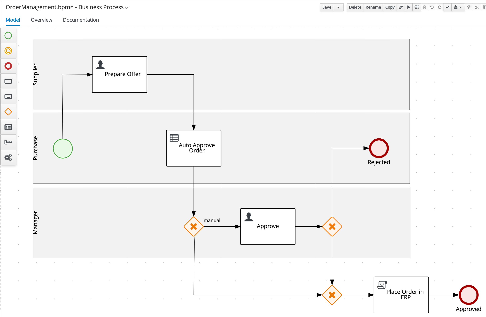

1. Create a new `Business Process` asset. Name it `OrderManagement`. You can do this by clicking `Add an Asset` and then selecting `Business Process` and then setting the name as `OrderManagement`.

1. When the process designer opens, scroll down in the property panel on the right side of the screen, until you see the section *Process Data*.

1. Expand the *Process Data* section and add the following 3 *Process Variables* by clicking on the *+* sign.

    | Name| Data Type|
    |----------- | -----------|
    | orderInfo | OrderInfo |
    | supplierInfo | SupplierInfo |
    | approved | Boolean |

    

### Prepare Offer

1. In the palette on the left-side of the editor, select the `Lane` component:

    

1. Create the following 3 swimlanes:  **Supplier** , **Purchase** ,  **Manager**

    

   1. Create the **Start Event** node in the `Purchase` swimlane.
   1. Create the `Prepare Offer` **User Task** node in the `Supplier` swimlane and connect it to the **Start Event** node. Set the following properties on the node via the properties panel on the right side of the screen:

      1. Task Name: `PrepareOffer`
      1. Subject: `Prepare Offer for #{orderInfo.item}`
      1. Actors: `#{supplierInfo.user}`
      1. Input:

    <table>
    <caption>Data Inputs and Assignments</caption>
    <colgroup>
    <col style="width: 33%" />
    <col style="width: 33%" />
    <col style="width: 33%" />
    </colgroup>
    <tbody>
    <tr class="odd">
    <td>
Name
</td>
    <td>
Data Type
</td>
    <td>
Source
</td>
    </tr>
    <tr class="even">
    <td>
orderInfo
</td>
    <td>
OrderInfo
</td>
    <td>
orderInfo
</td>
    </tr>
    <tr class="odd">
    <td>
supplierInfo
</td>
    <td>
SupplierInfo
</td>
    <td>
supplierInfo
</td>
    </tr>
    </tbody>
    </table>

      1. Output

    <table>
    <caption>Data Outputs and Assignments</caption>
    <colgroup>
    <col style="width: 33%" />
    <col style="width: 33%" />
    <col style="width: 33%" />
    </colgroup>
    <tbody>
    <tr class="odd">
    <td>
Name
</td>
    <td>
Data Type
</td>
    <td>
Source
</td>
    </tr>
    <tr class="odd">
    <td>
supplierInfo
</td>
    <td>
SupplierInfo
</td>
    <td>
supplierInfo
</td>
    </tr>
    </tbody>
    </table>

    

1. Create the `Auto Approve Order` **Business Rule** node in the `Purchase` swimlane and connect it to the `Prepare Offer` node. Set the following properties:
   - Rule language: `DMN`
   - Assigments:

<table>
<caption>Data Inputs and Assignments</caption>
<colgroup>
<col style="width: 33%" />
<col style="width: 33%" />
<col style="width: 33%" />
</colgroup>
<tbody>
<tr class="odd">
<td>
Name
</td>
<td>
Data Type
</td>
<td>
Source
</td>
</tr>
<tr class="even">
<td>
Order Information
</td>
<td>
OrderInfo
</td>
<td>
orderInfo
</td>
</tr>
<tr class="odd">
<td>
Supplier Information
</td>
<td>
SupplierInfo
</td>
<td>
supplierInfo
</td>
</tr>
</tbody>
</table>

<table>
<caption>Data Outputs and Assignments</caption>
<colgroup>
<col style="width: 33%" />
<col style="width: 33%" />
<col style="width: 33%" />
</colgroup>
<tbody>
<tr class="odd">
<td>
Name
</td>
<td>
Data Type
</td>
<td>
Target
</td>
</tr>
<tr class="even">
<td>
Approve
</td>
<td>
Boolean
</td>
<td>
approved
</td>
</tr>
</tbody>
</table>

  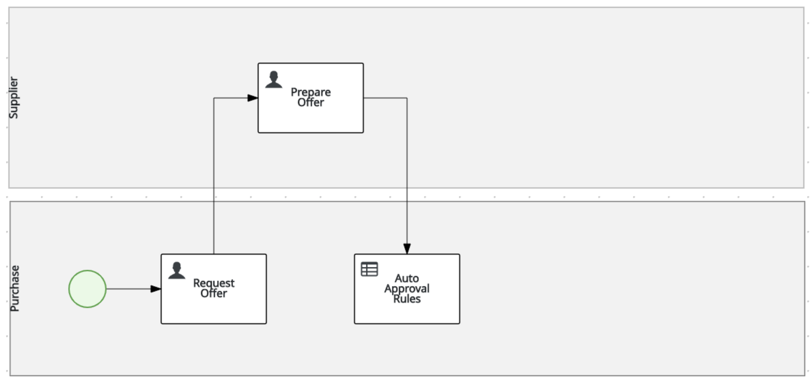

  > 📘 INFO: After we've created our DMN Decision Model, we will revisit the configuration of this node to reference this DMN model via its `name` and `namespace` properties.

### Exclusive Gateway

1. Create an **X-OR Gateway**/**Exclusive Gateway** in the `Manager` swimlane, below the `Auto Approve Order` node and connect it to that node.

    

1. Create the `Approve` **User Task** in the `Manager` swimlane and connect it to the **X-OR** gateway. Set the following properties:
    - Task Name: `Approve`
    - Subject: `Approve Order of #{orderInfo.item}`
    - group: `rest-all`
    - Assignments:

     <table>
     <caption>Data Inputs and Assignments</caption>
     <colgroup>
     <col style="width: 33%" />
     <col style="width: 33%" />
     <col style="width: 33%" />
     </colgroup>
     <tbody>
     <tr class="odd">
     <td>
Name
</td>
     <td>
Data Type
</td>
     <td>
Source
</td>
     </tr>
     <tr class="even">
     <td>
orderInfo
</td>
     <td>
OrderInfo
</td>
     <td>
orderInfo
</td>
     </tr>
     <tr class="odd">
     <td>
supplierInfo
</td>
     <td>
SupplierInfo
</td>
     <td>
supplierInfo
</td>
     </tr>
     </tbody>
     </table>
     <table>
     <caption>Data Outputs and Assignments</caption>
     <colgroup>
     <col style="width: 33%" />
     <col style="width: 33%" />
     <col style="width: 33%" />
     </colgroup>
     <tbody>
     <tr class="odd">
     <td>
Name
</td>
     <td>
Data Type
</td>
     <td>
Target
</td>
     </tr>
     <tr class="even">
     <td>
orderInfo
</td>
     <td>
OrderInfo
</td>
     <td>
orderInfo
</td>
     </tr>
     </tbody>
     </table>

    

1. Create an **X-OR Gateway**/**Exclusive Gateway** in the `Manager` swimlane, after the `Approve` node and connect it to that node.

    

1. Create another **X-OR Gateway**/**Exclusive Gateway** under the `Manager` swimlane (so outside of the swimlane) and connect it to the two other **X-OR Gateways**/**Exclusive Gateways** as shown in image below:

    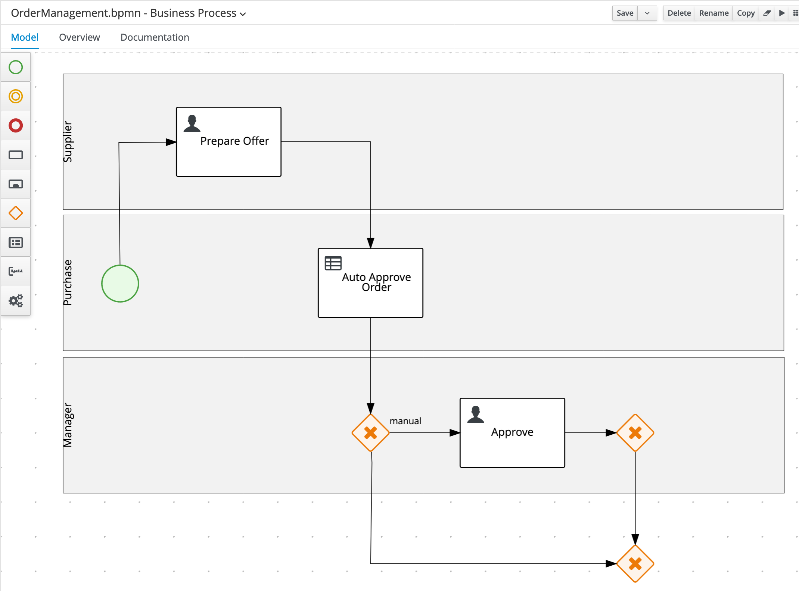

1. Create the `Place Order in ERP` **Script Task** under the `Manager` swimlane (so outside of the swimlanes) and connect it to the **X-OR Gateway** we created earlier. Set the following script in the node’s properties properties:

    ~~~java
    System.out.println("Place Order in ERP");
    ~~~

    

1. Create an **End Event** node under the `Manager` swimlane (so outside of the swimlanes) and connect it to the `Place Order in ERP` node. Name it `Approved`.

    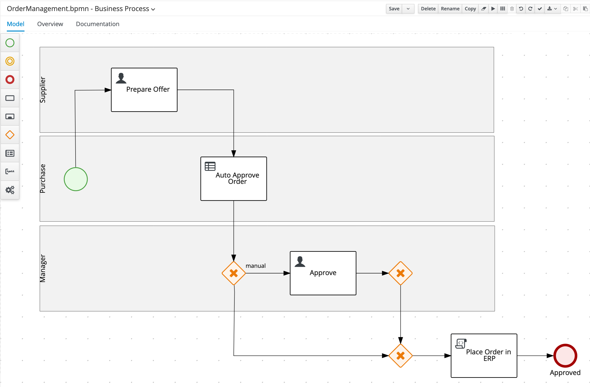

1. Create an **End Event** node in the `Purchase` swimlane and connect it to the **X-OR Gateway**. Name it `Rejected`.

    

1. On the **Sequence Flow** from the **X/OR Gateway** before the `Approve` node that is connnected ot the other **X/OR Gateway**, set the following condition, which tells the process engine that this path should be taken when the order is not automatically approved:
    - Process Variable: `approved`
    - Condition: `Is true`

    

1. On the **Gateway** before the `Approve node`, set the **Default Route** property to `Approve`.

    

1. On the **Sequence Flow** from the **X/OR Gateway** after the `Approve` task, which is connected to the **X/OR Gateway** before the `Place Order in ERP` task, set the following condition:
    - Process Variable: `orderInfo.managerApproval`
    - Condition: `Is true`

    

1. On the **X/OR Gateway** after the `Approval` node , set the **Default Route** to `Rejected`.

    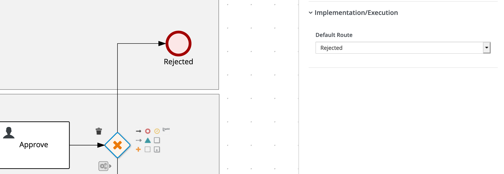

1. Save the process definition.

    

With the overall layout of the process definition complete, the routing logic implemented, and the I/O assignments defined, we can now implement the business rules of our automated approval decision.

## Business Rules and Decisions

Our **Order Management** process contains a **Business Rule Task**, but we have not yet defined the *Decision Model* that will be used in the task. In this paragraph we will implement the automatic approval rules in the form of a DMN model.

### Creating the DMN Inputs and BKM

1. In the main project page, the so called **library view**, click on the **Add Asset** button.

1. In the next screen, set the drop-down filter to **Decision**. Select the **DMN** asset. Give it the name `order-approval`.

    

1. In the DMN editor, open the property-panel on the right-side of the screen and set the
      *Namespace* property to: `http://www.redhat.com/dmn/demo/order-management-dmn` . First we need to import our data-model, so we can use it in our DMN decisions. In the DMN editor, click on the *Data Types* tab and click on the *Import Data Object* button at the right-hand side of the screen:

    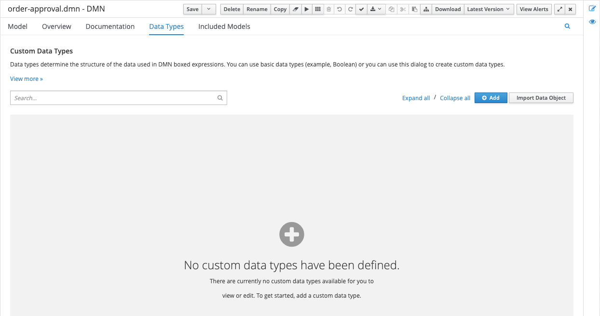

1. Select both the `OrderInfo` and `SupplierInfo` objects and click on the *Import* button:

    ![dmn-import-data-objects-select.png[]](../99_images/business_automation/order_management/dmn-import-data-objects-select.png[].png)

   ​ With the 2 datatypes imported, we need to create a third type that will hold the possible values for the `urgency` field of our `Order Information`. Click on the blue *Add* button in the top-right corner.

1. In the entry that opens, give the data type the *Name* `Urgency` and the *Type* `string`:

    

1. Click on the *Add Constraints* button, select `Enumeration` as the *constraint type*, and set the values  low` and `high`.

    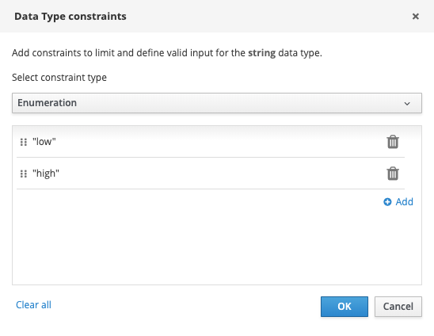

1. Click on the blue checkmark button to save the type.

    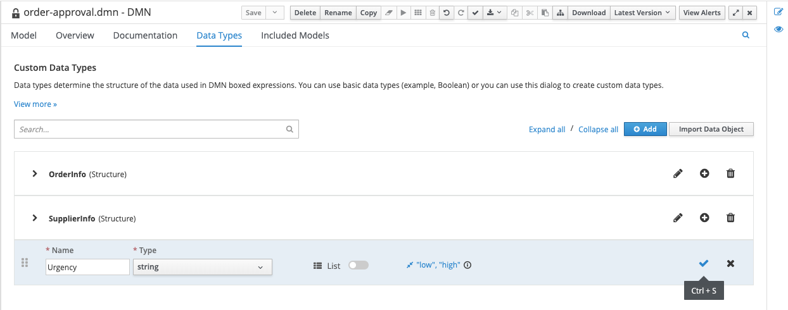

1. Navigate back to the model via the *Model* tab. Add 2 `Input` nodes to the model and name them `Order Information` and `Supplier Information`

    

1. Select the `Order Information` node. Open the properties panel on the right-hand side of the screen, and set the *Data type* to `OrderInfo`.

    

1. Do the same for the `Supplier Information` node. Set the *Data type* to `SupplierInfo`. Create a new `Business Knowledge Model` node, name it `Price Tolerance`.

1. Click on the node, and click on the *Edit* button to start editting the node:

    

    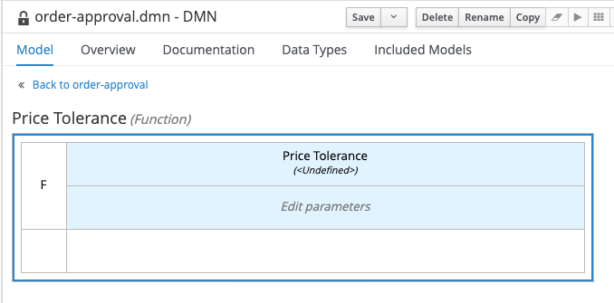

1. Click in the *Edit parameters*. An editor will open. Click on *Add parameter*. Name the parameter `order information` and set the type to `OrderInfo`.

    

1. Right click in the empty white cell under the parameter definitions and select *Clear*. The text *Select expression* will appear in the cell. Click on the cell and select `Decision Table`.

    

1. Add an *input clause* to the decision table. The name of the *input clause* is `order information.urgency`, which references the `urgency`  attribute of the `order information` parameter. Set the type to `Urgency`, which references the `Urgency` enumeration we created earlier.

    

1. Set the *output clause* data type to `number`. Leave the name empty.

    

1. Click on the `Price Tolerance` cell (top cell of the table), and set the data type to `number`.

    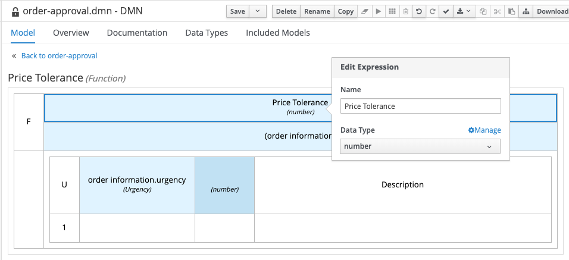

1. Implement the rest of the decision table as shown below. And save the DMN model.

    

### Writing the DMN Decision

In this section we will complete the writing of the DMN decision.

1. Navigate back to the model by clicking on the *Back to order-approval* link at the top-left of the editor. Create a new *Decision Node* and name it `Approve`. Connect the 2 input nodes and out `Price Tolerance` busines knowledge model node to the new decision node.

    

1. Select the `Approve` decision node and click on the edit button.

    

1. Click on \_Select Expression, and set the logic type to `Literal Expression`.

    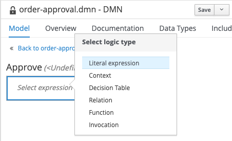

1. Enter the following expression: `Supplier Information.offer < Price Tolerance(Order  Information) * Order Information.targetPrice`

    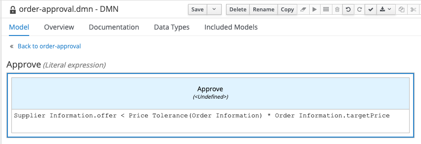

1. Click on the `Approve` cell (top cell of the table), and set the data type to `boolean`.

    

## Connecting the Decision to the Process

1. Navigate back to the model by clicking on the *Back to order-approval* link at the top-left of the editor.
1. Our DMN model is now complete. Make sure to save your model.
1. With our DMN model implemented, we can now revisit our **Business Rules Task** in our BPMN2 model. Open the `order-management` process definition and click on the`Auto Approval Order` node.
   1. Open the node’s properties in the property-panel on the right side of the editor, open the
       **Implementation/Execution** section and set:
       - Namespace: `http://www.redhat.com/dmn/demo/order-management-dmn`
       - DMN Model Name: `order-approval`
   1. In the same properties panel, expand the *Data Assignments* section and open the *Assignments* editor
   1. Implement the following data input and output assignments.

       

   1. Our BPMN model is now complete. Make sure to save the model.

Now, we should be able to create and implement our forms.

## Creating Forms

In this section we are going to create the process start and user-task forms. We could simply generate these forms with the click of a button, which gives us some standard forms based on the process and task data.

In this lab however, we will be creating these forms using the **Form Modeler** tool. This allows us to design these forms to our specific needs.

### Process Start Form

Let’s start with the process start form. We want to create the following form:

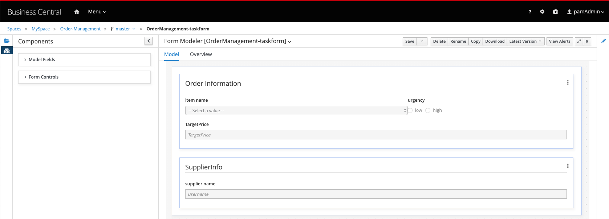

1. In the project’s library view, click on **Add Asset**. Filter on **Form**, click on the **Form** tile. Enter the details as shown in the screenshot below:

    

1. On this form we want to specify the initial order. We therefore require fields from the `orderInfo` and `supplierInfo` process variable. When we expand the `Model Fields` section, we can see our 2 process variables (`orderInfo` and `supplierInfo`). These are both complex objects. To work with complex objects (as opposed to simple types like integers and booleans), we require a data-form for that specific object. We therefore first need to create a data-form for our `OrderInfo` and `SupplierInfo` objects.

1. Go back to the project’s library view, click again on **Add Asset** and create a new form. Use the following details:

    

1. Using the Form Modeler constructs, create the following form:

    

1. To create this form, drag both the `item`, `urgency` and `targetPrice` onto the canvas and configure them as follows.

   - List Box:

    

- Radio Group:

    

- Decimal Box:

    

1. Save the form and create another new form for our `supplierInfo`. Use the following details.

    .

1. Using the Form Modeler constructs, create the following form:

    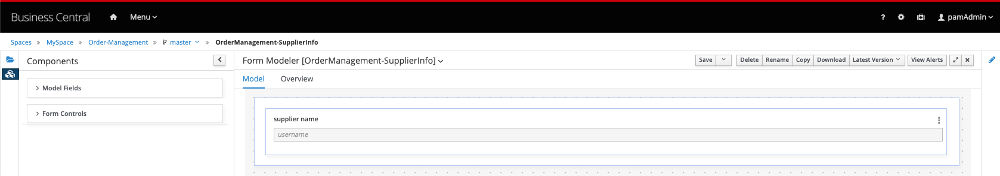

1. To create this form, drag the `user` field onto the canvas and configure it as follows.

    

1. Save the form and open the `OrderManagement` form (the first form we created).

1. Drag the `orderInfo` process variable onto the canvas. In the pop-up form, set the `OrderManagement-Order` form we just created as the **Nested Form**:

    

1. Drag the `supplierInfo` process variable ontoo the canvas. In the pop-up form, set the `OrderManagement-SupplierInfo` form we just created as the **Nested Form**:

    

### Prepare Offer Form

Next, we will create the form for the `Prepare Offer` **User Task**.

1. Create a new form. Provide the following details:

     

1. Our aim is to create a form that looks as such:

    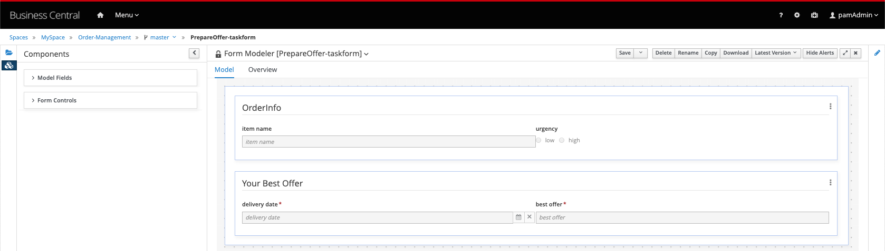

1. As with the process start form, this user-task form operates on 2 variables, `orderInfo` and `supplierInfo`. And, as with the process start form, we need to create a data-object form for each of these variables. Technically, data-object forms for a certain data-object can be reused in multiple task-forms. However, creating a data-object form per task-form allows us to design these data-object forms aimed for that specific task.

**PrepareOffer-OrderInfo**
    

**PrepareOffer-SupplierInfo**
    

---------------

Finally, we need to create the task form for the `Approve` task.

1. Create a new form. Provide the following details.

     .

1. Our aim is create a form that looks like this:

    

1. As with the other forms, this user-task form operates on 2 variables, `orderInfo`, `supplierInfo`. And, as with the other forms, we need to create a data-object form for each of these variables.

**Approve-SupplierInfo** 

**Approve-OrderInfo** 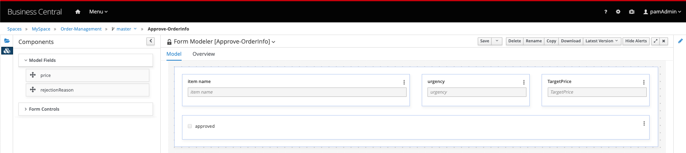

**Don’t forget to save all your forms!!!**

The implementation of our process is complete. It’s now time to deploy and test our application.

## Deploying the Process Service

With our **Order Management** project’s process, decisions and forms completed, we can now package our project in a Deployment Unit (KJAR) and deploy it on the Execution Server. To do this:

1. Go back to our project’s Library View (for example by clicking on the `Order Management` link in the breadcrumb navigation in the upper-left of the screen).

1. Click on the **Deploy** button in the upper-right corner of the screen. This will package our project in a Deployment Unit (KJAR) and deploy it onto the Execution Server (KIE-Server).

1. Go to the **Execution Servers** perspective by clicking on "Menu → Deploy → Execution Servers". You will see the **Deployment Unit** deployed on the Execution Server.

## Execute the process

In this section, you will execute the process deployed on the Process Execution Server via the Business Central workbench.

1. Navigate to **Menu → Manage → Process Definitions**. If everything is correct, the `order-management` process will be listed. Click on the kebab icon of the `order-management` process and click on **Start**.

    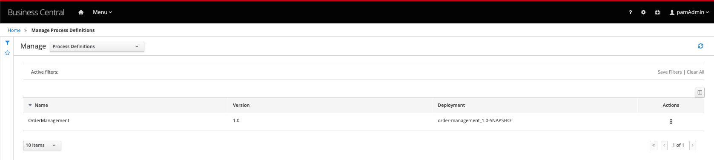

1. In the form that opens, pick the **Huawei P10 Phone** as the item and set the urgency to **low**. Set the target price to **700** and set the supplier name to the name of your own Business Central user (e.g. `bamAmdmin`). Click on **Submit**.

    

1. In the process instance details screen that opens, click on the **Diagram** tab to open the process instance diagram, which shows the current state of the process.

    

1. The process is in a wait state at the `Prepare Offer` task. Navigateto **Menu → Track** Task Inbox\*\*. Click on the `Prepare Offer` task to open its task window.

1. Click on the **Start** button to start working on the task. Because the task has been assigned to a single user (via \#{supplierInfo.user}), you don’t have to first *claim* the task.

1. Select a random delivery date. Set the best offer to **900**. Click on **Complete**. 

    

1. The process will continue to the `Auto Approve Order` decision node. Because of the target prices set, and the offered price, the decision will evaluale to `false`. Hence, the process will continue to the `Approve` task.

     

1. Go back to the **Task Inbox** and open the `Approve` task. Click on **Claim** and on **Start**. In this form we can approve or disapprove the order via the **approved** checkbox, and specify a **rejection reason** if we reject the order. Approve the task by checking the **approved** checkbox and clicking on **Complete**:

    

1. Go back to the process instance view and observe that the process instance is gone.

1. Enable the **Completed** checkbox in the **State** filter on the left-hand-side of the screen. Observe that we can see our process instance in the list.

1. Open the process instance, open it’s **Diagram** tab. Observe that the order has been accepted:

    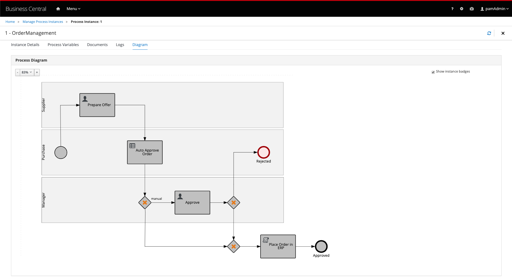

Run a couple more process instances with different values to test, for example, the functionality of the `Automated Approval Rules`.

## Correcting problems and errors

During process instance execution, a lot of things can go wrong. Users might fill in incorrect data, remote services are not available, etc. In an ideal world, the process definition takes a lot of these possible problems into account in its design. E.g. the process definition might contain exception handling logic via boundary catching error events and retry-loops. However, there are situations in which an operator or administrator would like to manually change the process to another statem for example, restart an already completed **User Task**. In the latest version of {{ product.name }} this is now possible via the **Process Instance interface** in Business Central.

1. Start a new process instance of our **Order Management** process.

1. Complete the `Prepare Offer` task in such a way that the order is not automatically approved and the process will hit the `Approve` *User Task* wait state.

1. Go to the **Process Instances** view and select the process instance. Navigate to the **Diagram** tab. Observe that the process is waiting in the `Approve` **User Task**.

1. Click on the `Prepare Offer` node to select it. In the **Node Actions** panel on the left-hand-side of the screen, verify that the `Prepare Offer` node is selected and click on **Trigger**. Observe that the `Prepare Offer` **User Task** has been activated.

1. Although we have re-activated the `Prepare Offer` node, we have not yet de-activated the `Approve` task. Click on the active `Approve` task and expand the **Node Instances** section in the **Node Actions** panel. Click on the kebab icon of the active `Approve` instance and click on **Cancel**:

     6. Open the **Task Inbox**. Observe that the `Approve` **User Task** is gone and that we have a new `Prepare Offer` task.

    - Open the `Prepare Offer` task, set the price to a price which will trigger the rules to automatically approve the order, and complete the task. Go to the process instances view and observe that the process instance has been completed. Enable the **Completed** filter in the **State** filter panel on the left-hand-side of the screen. Open the completed process instance and open its *Diagram* tab.

    

## Execute the process via APIs

The Execution Server provides a rich RESTful API that allows user to interact with the process engine and deployed processes via a REST. This powerful feature allows users to create modern user interface and
applications in their technology of choice (e.g. Entando DXP, ReactJS/Redux, AngularJS, etc.) and integrate these applications with the process engine to create modern, process driven, enterprise applications.

The Swagger interface provides the description and documentation of the Execution Server’s RESTful API. At the same time, it allows the APIs to be called from the UI. This enables developers and users to quickly test a, in this case, a deployed business process.

1. Navigate to the [KIE Server Swagger Page](http://localhost:8080/kie-server/docs)

1. Locate the **Process instances** section. The Process Instances API provides a vast array of operations to interact with the process engine.

1. Locate the **POST** operation for the resource `/server/containers/{containerId}/processes/{processId}/instances`. This is the RESTful operation with which we can start a new process instance. Expand the operation:

    

1. Click on the **Try it out** button.

    - Set the **containerId** to `order-management` (in this case we use the alias of the container).

    - Set the **processId** to `order-management.OrderManagement`.

    - Set **Parameter content type** to `application/json`.

1. Set the **Response content type** to `application/json`.

   - Set the **body** to:

      ~~~json
         { 
           "orderInfo" : {
           "com.myspace.order\_management.OrderInfo" : { 
               "item" : "Huawei P10", "urgency" : "low", "price" : 0.0, "targetPrice": "700.0" 
            }
      },
           "supplierInfo" : {
           "com.myspace.order\_management.SupplierInfo" : { "user" : "bamAdmin" }
            }
         }
      ~~~

       

1. Click on the *Execute* button.

1. If requested, provide the username and password of your **Business Central** and **KIE-Server** user (in this example we have been using u: `bamAdmin`, p:`ibmpam1!`).

    > 📘 INFO: If you're using the Linux environment on Skytap use the *pamadmin:pamadm1n* information

1. Inspect the response. Note that the operation returns the process instance id of the started process.

1. Go back to the Business Central workbench. Go the process instances view and inspect the process instance we have just started.

---------------

The RESTful API provides many more operations. Let’s use the API to fetch our **Task List** and complete the `Request Offer` task.

1. In the Swagger API, navigate to the **Process queries** section.

1. Find the **GET** operation for the resource `/server/queries/tasks/instances/pot-owners`. Expand the operation and click on the **Try it out** button.

1. Make sure the **\*Response content type** is set to `application/json`. Leave all the other fields set to their default values.

1. Click on the **Execute** button. This will return all the tasks for our user (in the case of this example this is the `bamAdmin` user).

    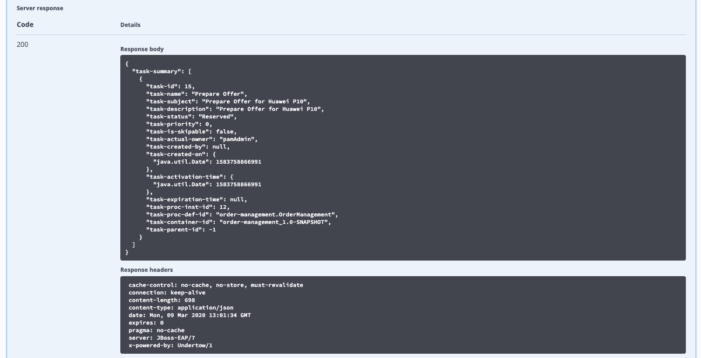

1. We can see the `Prepare Offer` task that is available in our inbox. Let’s complete this task.

1. Go to the **Task Instances** section in the Swagger interface and locate the **PUT** operation of the `/server/containers/{containerId}/tasks/{taskInstanceId}/states/completed` resource. This is the operation with which we can complete a task.

    - Set the **containerId** to `order-management`.

    - Set the **taskInstanceId** to the id of the task instance you want to complete. The task instance id  an be found in the list of task instances we got back from our previous REST operation.

    - Set **auto-progress** to `true`. This controls the auto progression of the taks through the various  states of the task lifecycle (i.e. claimed, started, etc.)

    - Set the **Parameter content type** to `application/json`.

    - Set the **Response content type** to `application/json`.

    - Set the **body** to:

    ~~~json
        { 
      "supplierInfo": {
            "com.myspace.order\_management.SupplierInfo" : { 
          "user": "bamAdmin", 
              "offer": "900", 
          "deliveryDate":"2020-03-11T12:00:00.000Z" 
            } 
          } 
        }
    ~~~

    > 📘 INFO: If you're using the Linux environment on Skytap use the following.

    ~~~json
        { 
      "supplierInfo": {
            "com.myspace.order\_management.SupplierInfo" : { 
          "user": "pamadmin", 
              "offer": "900", 
          "deliveryDate":"2020-03-11T12:00:00.000Z" 
            } 
          } 
        }
    ~~~

    - Click on the **Execute** button. If you’ve entered everything correctly, the task will be completed and the process will move to the next wait state, the `Prepare Offer` task. . Go back to the Business Central workbench. Go to the process instances view. Select the process instance of the task you’ve just completed. Observe that the `Prepare Offer` task has been completed and that the process is now waiting on the `Approve` **User Task**.

The rest of the tasks can be completed in the same way via the API.

## Using the KIE-Server Client

{{ product.name }} provides a KIE-Server Client API that allows the user to interact with  the KIE-Server from a Java client using a higher level API. It abstracts the data marshalling and unmarshalling and the creation and execution of the RESTful commands from the developer, allowing him/her to focus on developing business logic.

In this section we will create a simple Java client for our Order Management process.

1. Create a new Maven Java JAR project in your favourite IDE (e.g. IntelliJ, Eclipse, Visual Studio Code).

1. Add the following dependency to your project:

    ~~~xml
    <dependency>
     <groupid>org.kie.server</groupid>
      <artifactId>kie-server-client</artifactId>
      <version>{{ product.gav}}</version>
      <scope>compile</scope>
    </dependency> 
    ~~~

1. Create a Java package in your `src/main/java` folder with the name`com.myspace.order_management`.

1. Download the `OrderInfo.java` file from [this](https://raw.githubusercontent.com/DuncanDoyle/order-management-rhpam-lab-client/master/src/main/java/com/myspace/order_management/OrderInfo.java) location and add it to the package you’ve just created.

1. Download the *SupplierInfo.java* file from [this](https://raw.githubusercontent.com/DuncanDoyle/order-management-rhpam-lab-client/master/src/main/java/com/myspace/order_management/SupplierInfo.java) location and add it to the package.

1. Create a new Java class called `Main`. Add a `public static void main(String[] args)` method to your main class.

1. Before we implement our method, we first define a number of constants that we will need when implementing our method (note that the values of your constants can be different depending on your environment, model namespace, etc.):

    ~~~java
    private static final String KIE_SERVER_URL = "http://localhost:8080/kie-server/services/rest/server"; 
    private static final String CONTAINER_ID = "order-management"; 
    private static final String USERNAME = "bamAdmin"; 
    private static final String PASSWORD = "ibmpam1!"; 
    private static final String PROCESS_ID = "order-management.OrderManagement";
    ~~~

    > 📘 INFO: If you're using the Linux environment on Skytap use the following.

    ~~~java
    private static final String KIE_SERVER_URL = "http://localhost:8080/kie-server/services/rest/server"; 
    private static final String CONTAINER_ID = "order-management"; 
    private static final String USERNAME = "pamadmin"; 
    private static final String PASSWORD = "pamadm1n"; 
    private static final String PROCESS_ID = "order-management.OrderManagement";
    ~~~

1. KIE-Server client API classes can mostly be retrieved from the `KieServicesFactory` class. We first need to create a `KieServicesConfiguration` instance that will hold our credentials and defines how we want our client to communicate with the server:

    ~~~java
    KieServicesConfiguration kieServicesConfig = KieServicesFactory.newRestConfiguration(KIE_SERVER_URL, new EnteredCredentialsProvider(USERNAME, PASSWORD)); 
    ~~~

1. To allow the KIE-Server Client’s marshaller to marshall and unmarshall instances of our domain model, we need to add our domain model classes to the `KieServicesConfiguration`.

    ~~~java
    Set<Class<?>> extraClasses = new HashSet<>();
    extraClasses.add(OrderInfo.class);
    extraClasses.add(SupplierInfo.class);
    kieServicesConfig.addExtraClasses(extraClasses);
    ~~~

1. Next, we create the `KieServicesClient`:

    ~~~java
    KieServicesClient kieServicesClient = KieServicesFactory.newKieServicesClient(kieServicesConfig);
   ~~

1. From this client we retrieve our `ProcessServicesClient`:

    ~~~java
    ProcessServicesClient processServicesClient = kieServicesClient.getServicesClient(ProcessServicesClient.class);
    ~~~

1. We now create a `Map` which we will use to pass the process input variables. We create a new `OrderInfo` instance and `SupplierInfo` instance and put them in the `Map`.

    ~~~java
    Map<String, Object>inputData = new HashMap<>();
    OrderInfo orderInfo = new OrderInfo();
    orderInfo.setItem("Huawei P10");
    orderInfo.setUrgency("low");
    inputData.put("orderInfo", orderInfo);
    
    SupplierInfo supplierInfo = new SupplierInfo();
    supplierInfo.setUser("bamAdmin"); inputData.put("supplierInfo", supplierInfo); 
    ~~~

    > 📘 INFO: If you're using the Linux environment on Skytap use *pamadmin*:*pamadm1n* as the username password

    ~~~java
    Map<String, Object>inputData = new HashMap<>();
    OrderInfo orderInfo = new OrderInfo();
    orderInfo.setItem("Huawei P10");
    orderInfo.setUrgency("low");
    inputData.put("orderInfo", orderInfo);
    
    SupplierInfo supplierInfo = new SupplierInfo();
    supplierInfo.setUser("pamadmin"); inputData.put("supplierInfo", supplierInfo); 
    ~~~

1. We can now start a new process instance via the `ProcessServicesClient`.

    ~~~java
    Long processInstanceId = processServicesClient.startProcess(CONTAINER_ID, PROCESS_ID, inputData);
    ~~~

1. Finally, we can print the process instance id to `System.out`.

    ~~~java
    System.out.println("New *Order Management* process instance started with instance-id: " + processInstanceId); 
    ~~~

1. Compile your project and run it. Observe the output in the console, which should say: **New *Order Management* process instance started with instance-id**

---------------

The complete project can be found here: <https://github.com/timwuthenow/rhpam7-order-management-demo-repo>

The KIE-Server Client provides more services to interact with the Execution Server:

- `UserTaskServicesClient`: provides functionality to interact with the **UserTask** services, for example to claim, start and complete a **User Task**.

- `CaseServicesClient`: provides functionality to interact with the **Case Management** features of the Execution Server.

- `ProcessAdminServicesClient`: provides the administration API for processes.

- etc.

We leave as an exercise to the reader to try to complete a **User Task**, of the process instance we’ve just created, using the `UserTaskServicesClient`.
