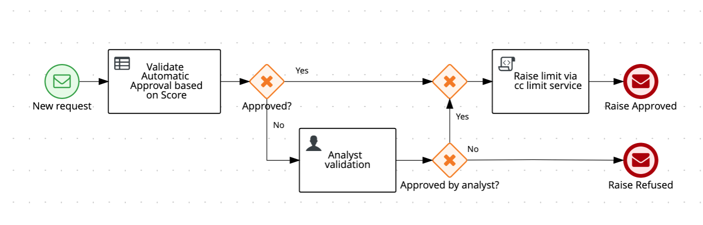

# Emmitting Events from Business Processes

In order to be able to finish processes based on new events, we will need to set up our environment.

In this setup we will:

- Check the required configuration in the business project
- Add bpmn components to emit messages

## Emitting events in a business process

1. Now, we need to *End Message Events*  instead of two *End Events*. In Business Central, open the `cc-limit-approval-app` process.

1. Convert the two *End Events* to *End Message Events*. It should look like this:

  {:width="600px"}

1. Next, configure the Kafka topic name in the message name for both nodes as following:

      - `Raise Approved` message name: `requests-approved`
      - `Raise Denied` message name: `requests-denied`

        See below one of the nodes, the *Raise Denied* node configuration:

        {:width="600px"}

1. Save the process definition.

1. On the breadcrumb, click on "cc-limit-approval-app-step1" to go back to the Project Explorer view.

1. Click on the "Deploy" button.

## Configuring the business application

1. In Business Central, navigate to the **Project Settings -> Deployments -> Work Item handlers**:

    {:width="600px"}

Observe that there is a task configured named `Send Task`. In {{ product.short }} {{ version }} you need this configuration to be able to use any `Message Events` (ending and throwing) that would emit events.

## Consuming the events from Kafka topic using Kafka Consumer CLI

In order to validate if our process is emitting processes as we expect, we need to listen to the Kafka topics `requests-approved` and `requests-denied` to validate if the messages were emitted correctly.

1. Open a new terminal tab, and navigate to the Kafka project folder.

    ~~~shell
    cd ~/enablement/amq-examples/strimzi-all-in-one/
    ~~~

1. Start the Kafka command line tool that allows us to consume events that happen in a topic, and therefore, will allow us to know if {{ product.short }} published the events when the process ended. The tool is `kafka-console-consumer.sh`. Let's check if the process emitted events on the topic `requests-approved`.

    ~~~shell
    docker-compose exec kafka bin/kafka-console-consumer.sh --topic requests-approved --from-beginning --bootstrap-server localhost:9092
    ~~~

## Testing the solution

To test the solution, we will start a new process instance that will start, be automatically approved, and end without any human interaction. A new process instance should get started whenever you publish a new event on the `incoming-requests` topic, and, when there is an automatic approval, the process will end and publish an event to the `requests-approved` topic. Let's see this in action:

1. Like we did on the first lab, let's start a new process instance by publishing a message in the `incoming-requests` topic. If you canceled the execution of the kafka producer, here's how you can start it:

    ~~~shell
    docker-compose exec kafka bin/kafka-console-producer.sh --topic incoming-requests --bootstrap-server localhost:9092
    ~~~

    You can use the following data in your event: `{"data" : {"customerId": 1, "customerScore": 250, "requestedValue":1500}}`

1. Once you publish the event, a new process should get started.

1. Now check the terminal where you are consuming the messages in the `requests-approved` topic. You should see a new event published by your process. The event will look like this (though not on multiple lines):

    ~~~json
    {
    "specversion":"1.0",
    "time":"2021-04-14T18:04:42.532-0300",
    "id":"25ba2dd0-a8d0-4cfc-9ba4-d2e556ffb4d0",
    "type":"empty",
    "source":"/process/cc-limit-approval-app.cc-limit-raise-approval/5",
    "data":null
    }
    ~~~

1. Identify the process ID on the event above. In this example, the process instance that emitted this event was process of ID **5**.

1. Let's check this same process instance in Business Central. In Business Central, open the **Menu -> Manage -> Process Instances**.

1. On the left column, filter by "Completed" State. You should see as many instances as the number of events you published on Kafka.

    {:width="600px"}

1. Identify your process instance ID. In this example, instance with id **5**. Select the process instance.

1. Next, select the tab `Diagram`. You should see something like:

    {:width="600px"}
