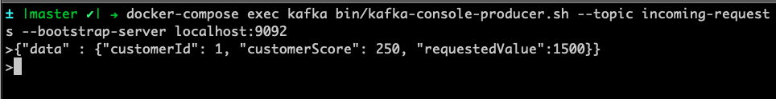

# The Credit Card Raise Approval Project

In this use case we would like to handle the automation of a credit limit increase approval process. Most card issuers allow customers to request an increased credit limit through various entry points such as: websites, their mobile applications or over the phone with customer service. Let’s consider we need to deliver this automation for a bank that wants to achieve a similar use case within an event-driven architecture.

{:width="600px"}

The existing process is started via REST. It has a step for automatic request validation using DMN, and if the request not approved, it goes to a manual review queue. If approved, the service responsible for updating the cc limit is invoked via REST (the diagram only represents this REST call with a script task since this is not relevant for this lab's scenario). Finally, the process ends either with an approved or denied request.

Now, with the architecture shift, the service responsible for increasing the credit card limit should not be invoked via REST anymore. The external service now listens to the topic “request-approved” in order to track when to execute the limit raise. The business process should get started based on events, and whenever the process finishes, it should post a message to a specific topic depending on whether the request was approved or not.

{:width="600px"}
*Process v2. Whenever a new event happens in a topic, a new instance will be triggered. Depending on how this process ends, an event is published in a different topic, therefore, different services can react based on the approval status*.

In this strategy we have a resilient way of communication between services where the broker is responsible for storing and providing the events. Adding to that, the tech team can evolve the solutions by using the features available in Kafka itself, like the possibility to replay all the events that happened in a specific time, in chronological order.

## Importing the project

Let's import the existing project so we can start implementing the eventing capabilities.

1. Access Business Central, and import the following project: https://github.com/kmacedovarela/cc-limit-approval-app-step1
  {:width="600px"}

1. Let's check the existing project. Open the `cc-limit-raise-approval` process. Notice that currently it is a traditional process, with a standard start and stop node. Processes like this can be started either via REST or JMS.
  {:width="600px"}

## Reacting to events

The first task we'll do, is to enable the existing process to react to events that are published in a specific topic. Whenever a new event is published, a new process instance should be created.

1. To allow this process definition to be started with events, the first step is to change the start event to a *Start Message Event* by clicking the node in the editor and selecting the *envelope* icon to "Convert into Start Message":

    {:width="400px"}

1. Whenever a customer make a new request (independently of the channel used) an event should be published on the `incoming-requests` Kafka `topic`. This way as new channels are ready to be added, they just need to point to this request instead of modifying for the process end point. With that, a new process instance should be started whenever a new event is published in this topic. Let's configure the *Start Message Event* with the `incoming-requests` topic:
   
    {:width="400px"}

    >🚧  **WARN:** we need to receive the data that is the event data. The KIE Server provides automatic marshalling to help us mapping the input directly to a *Data Object* (a POJO). This project has an object named `LimitRaiseRequest.java` which we will use to receive the incoming data and feed it in the process.

1. On the properties panel of the *Start Message Event*, configure the input data:

    * Name: request
    * Data Type: `LimitRaiseRequest`
    * Target: request

    {:width="600px"}

1. Save the process. Your process should now look like this:
  {:width="800px"}

## Deploying the project

Now, let's deploy and test the project.

1. On the breadcrumb, click on "cc-limit-approval-app-step1" to go back to the Project Explorer view.

1. Click on the "Deploy" button.

## Testing the project

Let's publish a new event in the `incoming-requests` topic using the Kafka producer CLI tool.

1. Open a new tab in your terminal and access the `strimzi-all-in-one` project folder.

    ~~~shell
    cd ~/enablement/amq-examples/strimzi-all-in-one
    ~~~
  
2. Next, use the Kafka producer to publish new messages on the topic `incoming-requests`.

    ~~~shell
    docker-compose exec kafka bin/kafka-console-producer.sh --topic incoming-requests --bootstrap-server localhost:9092
    ~~~

3. You can send the following data, and press enter:

    ~~~json
    {"data" : {"customerId": 1, "customerScore": 250, "requestedValue":1500}}
    ~~~
  
    {:width="800px"}

4. Back to the browser, open Business Central. On the top menu, go to **Menu -> Manage -> Process Instances**.

5. On the left column, filter by "Completed" State. You should see as many instances as the number of events you published on Kafka:

    {:width="800px"}

6. Select a process instance, and next, select the tab `Diagram`. You should see something like:

  {:width="800px"}
