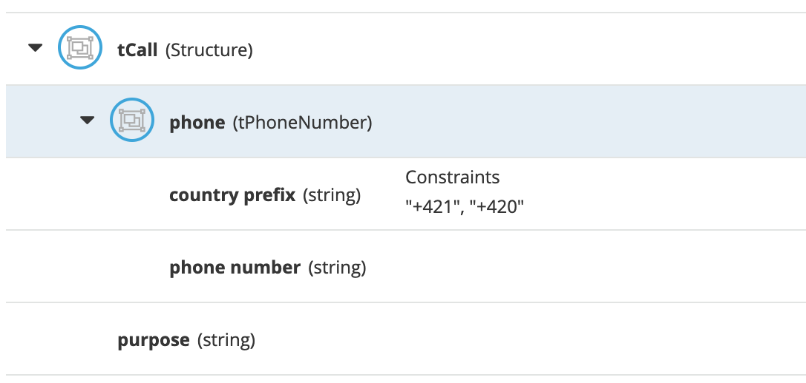
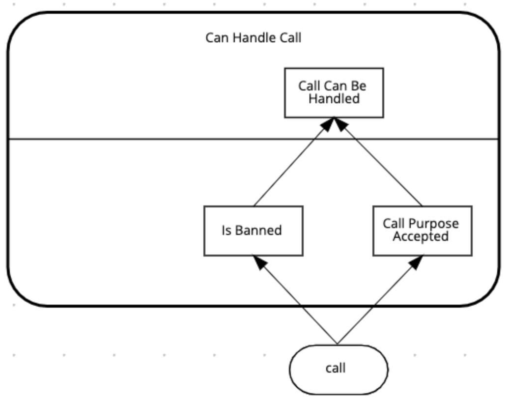

# Authoring the decisioning for the Call Center

The problem statement describes a number of different inputs to our decision:

-   **Call**: the incoming call into the call-centre

-   **Employees**: the employees of certain office.

-   **Office**: an office to which the call could potentially be routed.

Furthermore, the problem statement describes that phone numbers could be banned. So, also **banned numbers** can be regarded as an input to our model (although we will not implement it as an input in this lab).

With the given input, we need to make the following decisions: 

-   **Accept Call**: the final decision we need to make is whether the given office will accept the call.
- **Can Handle Call**: whether the office can actually accept the call. As defined in the problem statement, this depends on: 
  - whether the phone number has been banned;
  -  the purpose of the phone call (“help” or “objection”).

## . Accept Call Decision Structure

-   **Accept Call**: the final decision we need to make is whether the given office will accept the call.

    1.  Add a **Decision** node to the diagram by clicking on the **Decision** node icon and placing it in the DRD. 

        {:width="800px"}

    3.  Double-click on the node to set the name. We will name this node `Accept Call`.

    4.  With the `Accept Call` node selected, open the property panel. Set the **Output data type** to `boolean`.

        {:width="800px"}

    5.  The input of this decision is the **incoming call**, **office** and **employee**. Create these 3 input nodes and connect them to the **Accept Call** decision.

        {:width="600px"}

    6.  We can now set data types of our input nodes.

        1.  Click on the `incoming call` node, open the property panel and in the **Output data type** section and click on the **Manage** button. This will open the **Custom Data Types** window.

        2.  In the **Custom Data Types** window, click on the **+ Add** button.

        3.  Define the data type `tPhoneNumber` as follows:

            {:width="400px"}

        4.  Define another data type `tCall` as follows. Note that this datatype has a field that is of type `tPhoneNumber`, the type we defined earlier:

            {:width="400px"}

        5.  When you’ve created the `tCall` type, go back to the DRD by clicking on the **Model** tab.

        6.  Select the `incoming call` node, and in the property panel, set the node’s **Output data type** to `tCall`

            {:width="800px"}

    7.  Next, define the following data type and set it as the **Output data type** of the `office` input as such:

        {:width="350px"}

    8.  Define the data type for `employees` as follows. Note that we’ve first defined the type `tEmployee`, and afterwards we’ve defined `tEmployees` as a `List` of `tEmployee`.

        {:width="800px"}

## Decision Service

With the main structure defined, we can now look at the requirements of the decision whether the office can actually accept the call. As defined in the problem statement, this depends on:

-   whether the phone number has been banned.

-   the purpose of the phone call ("help" or "objection").

We will model this decision as a DMN **Decision Service** that can be called by our main decision `Accept Call`.

1.  First, model the **Decision Service** in the DRD and give it the name `Can Handle Call`. Set it’s **Output data type** to `boolean`.

    {:width="800px"}

2.  Add a **Decision Node** to the **Decision Service**. Name it `Call Can Be Handled` and set it’s **Output data type** to `boolean`.

    {:width="800px"}

3.  Add 2 additional **Decision Nodes** and name them `Is Banned` and `Call Purpose Accepted`. Both should have an **Output data type** of type `boolean`.

4.  Connect the 2 **Decision Nodes** to the `Call Can Be Handled` node.

    {:width="800px"}

5.  The input to both the `Is Banned` and `Call Purpose Accepted` decisions is a `call`. Connect the existing node "incoming call" to the 2 decision nodes.

    {:width="400px"}

6.  The `Is Banned` decision also needs a collection of banned phone numbers. Instead of implementing this as an **Input** node, we will implement this as a DMN **Relation Decision**.

    1.  Create a new **Decision Node** and name it `Banned Phone Numbers`. Connect it to the `Is Banned` decision node.

        {:width="400px"}

    2.  The **Ouput data type** of this nodes is a new custom data type, which is a list of `tPhoneNumber`. We’ll name this type `tPhoneNumbers`:

        {:width="400px"}

    3.  Click on the **Edit** button of the `Banned Phone Numbers` node. Set the **logic type** of the decision to `Relation`. Create the following table:

        {:width="500px"}

7.  We can now implement the logic of the `Is Banned` decision. Click on the **Edit** button of the decision node. We will implement the logic as a **Literal Expression**. Define the following FEEL expression:

    ~~~
      list contains(Banned Phone Numbers, call.phone) 
    ~~~

8.  The next node for which we want to implement the decision logic is `Call Purpose Accepted`. Click on the node, and click on the **Edit** button. Implement the following logic as a **Decision Table**:

    {:width="600px"}

9.  We can now implement the decision of `Call Can Be Handled`. Click on the node and click on the node’s **Edit** button. In the decision editor, set the **logic type** to **Decision Table** and implement the following table:

    {:width="600px"}

10. Create a DMN **Knowledge Requirement** from the `Can Handle Call` decision service to the `Accept Call` decision.

    {:width="800px"}

##  "Accept Call" Decision Logic

11. Implement the `Accept Call` decision logic as follows. {:width="800px"}

Notice that the line 1 is the invocation of the decision service "Can Handle Call". This is an **Invocation** of the `Can Handle Call` service, passing the `incoming call` input as the variable `call`. The output of this invocation will be the `boolean` variable `Call can be handled`. 

The `Call can be handled` variable as then used to validate the decision result in the last line.

## Next steps

We're done. Next, we should deploy the project in KIE Server and test the model using the REST and Java API.

