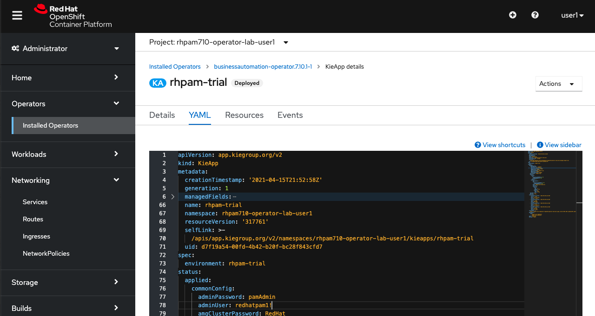

# KIE App Configuration

The definition of the expected state of KIE-App environment is defined in the YAML definition the KIE-App. In this section we will slightly change this configuration to see how the Operator applies changes in the configuration of your Red Hat Process Automation Manager environment.

## Changing Credentials

1.  Go back to the YAML definition of your `rhpam-trial` KieApp.

2.  Add a `commonConfig` section, with the `adminUser` to the value `pamAdmin`, and the `adminPassword` to `redhatpam1!`. Click on the **Save** button.
	

	```
	spec:
	  commonConfig:
	    adminPassword: pamAdmin
	    adminUser: redhatpam1
	```

3.  Click the **Reload** button to reload the YAML view.

4.  Click on the **Overview** tab. Notice the deployments re-deploying.

5.  Click on the **Business/Central Central URL** to open the Business Central console.

6.  Log in with the new username and password: `pamAdmin`/`redhatpam1!`.

##  Adding a KIE-Server

Apart from changing some configuration parameters, we can also change the topology our deployment in the KieApp YAML file.

1.  Go back to the YAML definition of your `rhpam-trial` KieApp.

2.  Add a `servers` section and set the `replicas` parameter of the `rhpam-trial-kieserver` to **2**. {:width="650px"}

	```
	objects:
	  servers:
	    - deployments: 1
	      name: rhpam-trial-kieserver
	      replicas: 2
	```

3.  Click the **Save** button.

4.  Go to **Workloads → Deployment Configs**. Note that there are now 2 KIE-Server Deployment Configs. 
	{:width="650px"}

5.  Go back to the YAML definition of your `rhpam-trial` KieApp.

6.  Navigate to the `servers` section and add the property `deployments` with the value **2**.

	```
	objects:
	  servers:
	    - deployments: 2
	      name: rhpam-trial-kieserver
	      replicas: 2
	```

7.  Click the **Save** button.

