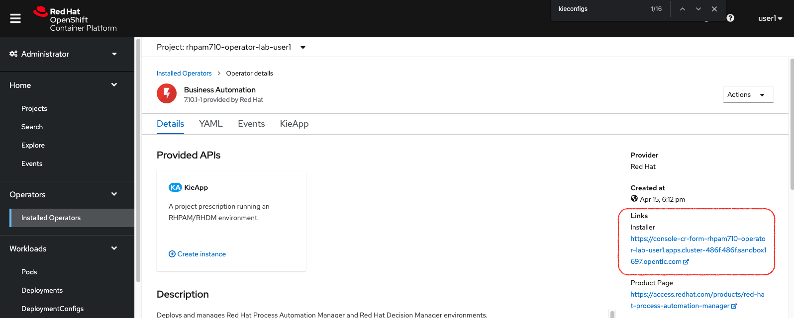
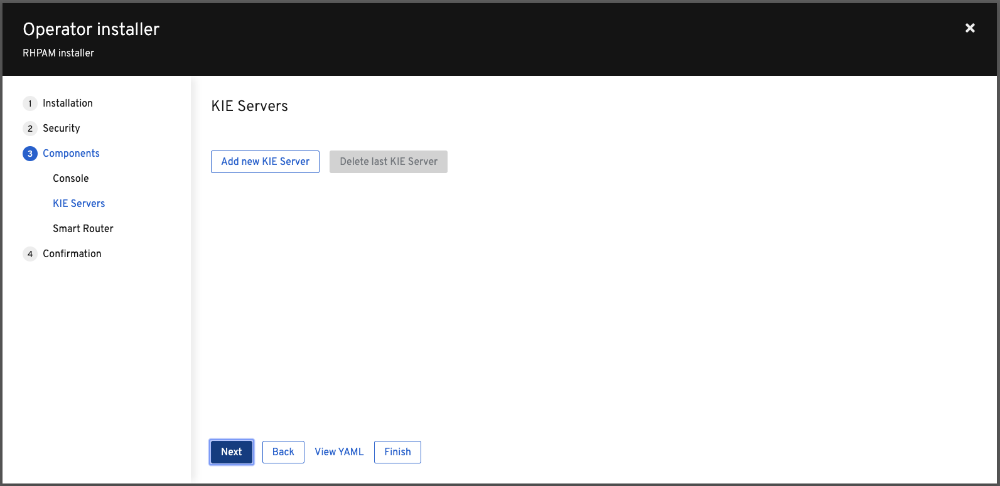

# Operator Wizard Walkthrough

The Business Automation Operator contains an *Operator Installer Console*. This console gives you a *wizard* experience to deploy {{ product.name }} environments.

## Wizard walk through

1. Go the Business Automation Operator and click in **Installer** link.
    {:width="650px"}
    {:width="650px"}

1. Login with Openshift. A page will show up asking for authorization. Select all options and click on "Allow selected permissions".

1. Give the application the name `my-rhpam-prod`.

1. Select the `rhpam-production` for the Enviroment.

1. Check the **Enable Upgrades** checkbox.

1. Scroll down and set the Username and Password to `bamAdmin`:`ibmpam1`.

1. Click the **Next** button.

1. Don’t change any values in the **Security** section. Click on **Next**.

1. Go through the **Components** section of the installer and observe the possible options. Don’t change any values for now.

1. Keep clicking next until you reach the **Confirmation** screen and click **Deploy**.

1. Go back to the OpenShift Console.

1. Navigate to **Workloads → Deployment Configs** and observe that a new {{ product.name }} production environment has been deployed. Note that this environment has a PostgreSQL database deployed. Also note that both the Business Central and KIE-Server Deployment Configs have their ReplicationController set to 3 pods. {:width="650px"}

1. Go back to the **Operators → Installed Operators → Business Automation → KieApp**.

1. Delete the `my-rhpam-prod` we’ve just deployed with the Installer.

## How to KIE Server with more replicas

We will now deploy a new production environment using the installer, but this time we will configure our KIE-Server in the wizard and set the replications of the KIE-Server to 2 instead of 3.

1. Go back to the Business Automation Operator, and open the Wizard.

1. Create a new {{ product.short }} Production Environment. Continue until you reach the **KIE Servers** screen. {:width="650px"}

1. Click **Add new KIE Server** and use the following configuration for your KIE-Server. {:width="800px"}

1. Click through the rest of the screens until you can press the **Deploy** button to deploy the environment.

1. Navigate to the **Workloads → Deployment Configs** screen to see your {{ product.short }} production environment, including the KIE-Server you configured.

## Conclusion

This concludes the lab on the Business Automation Operator. If you have time left, feel free to explore more features of the operator.
