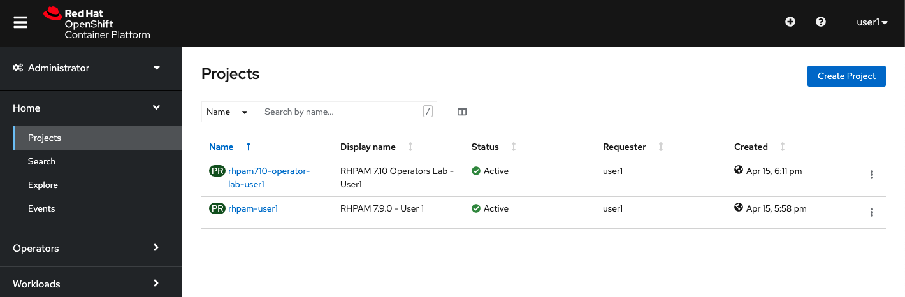
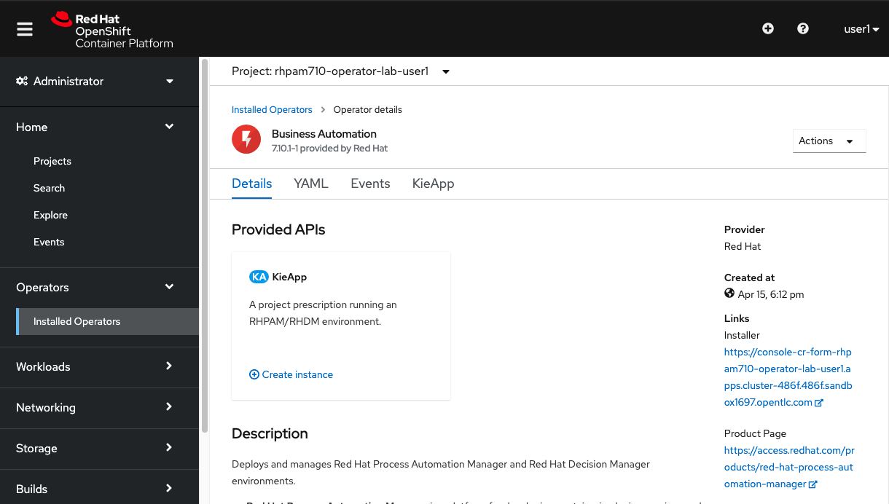

# Red Hat PAM Operator on OpenShift 4

In this lab we will use the enhanced Business Automation Operator **7.10+** to deploy a number of {{ product.name }} environments on OpenShift **4.**

## Goal

-   Install the Business Automation Operator on OCP 4.
-   Use the Business Automation Operator 7.10 to deploy a number of Process Automation Manager environments.
-   Change the KIE-App deployment CRDs to show reconciliation.
-   Change Operator ConfigMaps to make advanced configuration changes to the KIE-App.

# Problem Statement

In this lab, the goal is to provision and manage various {{ product.name }} architectures using the Business Automation Operator on OpenShift 4.

-   We deploy an {{ product.short }} Trial environment, which is a basic ephemeral environment that does not require any form of storage (e.g. persistent volume, database).
-   We explore Operator reconciliation features by removing provisioned resources like Services and Deployment Configs.
-   We alter the deployment through the Operator to show how the provisioned environment changes.
-   We change a KIE configuration parameter in the Business Automation Operator ConfigMap to demonstrate advanced configuration changes.
-   We provision a more sophisticated Production environment, to show creation of PVCs, deployment of databases and integration with {{ product.short }} Smart Router.
-   We use the Operator Installer console to install a new KIE-App deployment.

## First steps

**If you are using your own OpenShift environment**, follow the steps below to create a project and install the operator. If you are trying this lab in an environment provisioned by the Red Hat team, skip to the section `Inspect the Lab environment`.

1. Create a new project in OpenShift. We suggest the name `rhpam710-operator-lab-user1`.

	{:width="650px"}

2. Navigate to `Operators`, `Operator Hub`, and search for `Business Automation`:

	{:width="650px"}

3. Click on the Business Automation and then, click `Install`. 

	{:width="650px"}

4. You can select the following options, and click on `Submit`:

	{:width="650px"}

5. Once subscribed, you should wait for the operator to get provisioned. Then you can proceed with the lab.

	{:width="650px"}

## Inspect the Lab environment

If you attending to an enablement with a provisioned environment. We provisioned an environment where each user already has a subscription to the Business Automation Operator. These Operator subscriptions are managed by the OpenShift cluster admin.

1.  Navigate to the OpenShift Master url.
2.  Login to the platform with the provided username and password.

	{:width="650px"}

1.  Open the project `rhpam710-operator-lab-userX`. Open the *Workloads* tab. Observe that the `business-automation-operator` has already been provisioned to your project. This has been done by the cluster-admin by subscribing your project to the Business Automation Operator. {:width="650px"}

2.  Expand the **Operators** menu group in the left-hand-side of the screen and click on **Installed Operators**. This will show the installed Operators, or Operator Subscriptions, in your OpenShift namespace. {:width="650px"}

3.  Click on **Business Automation** to access the **Business Automation** Operator instance in your project. {:width="650px"}

