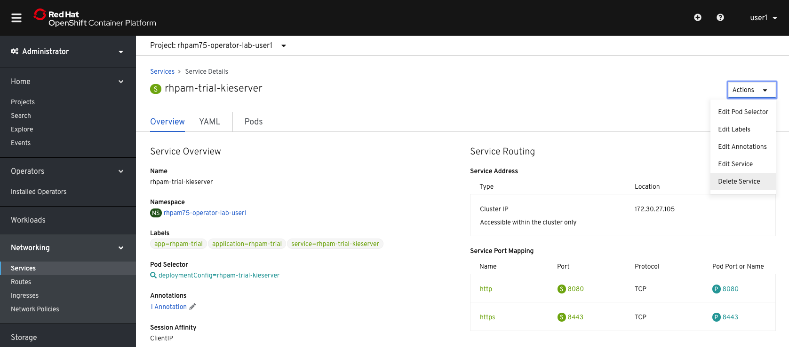

# Reconciliation 

The OpenShift Operators provide functionality to reconciliate an existing environment in order to bring it back to its expected state. We will now test this feature by removing one of the required resources from our deployment.

2.  Open the **Resources** tab. This will show all the resources of the application deployed and managed by the Operator. {:width="650px"}

3.  On the fourth row, we can see the `rhpam-trial-kieserver` **Service** resource.

4.  In the left menu, go to **Networking → Services**. Open `rhpam-trial-kieserver`.

5.  Delete the **Service** by clicking on the **Actions** button at the upper right of the screen and clicking on **Delete**. {:width="650px"}

6.  Notice the **Service** disappearing and immediately reappearing. This is the Operators reconciliation logic at work, bringing the environment back in its expected state.

