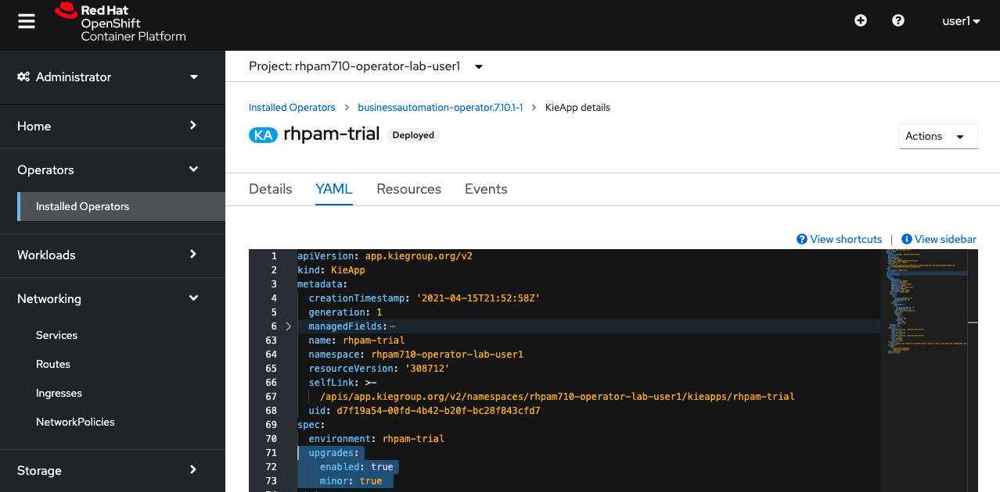

# Version Upgrades

The Operator of RHPAM is also capable of doing both patch and minor upgrades. This means that, for example, the Operation can upgrade an RHPAM environment from 7.10.0 to 7.10.1 or from 7.10.1 to 7.11.0.

1. When creating a new KieApp, you can find the option to enable the version updates. 
	{:width="650px"}

2.  If both the **Enable Upgrades** and **Include minor version upgrades** settings are set to true, the KieApp YAML configuration will include the following spec: 
	{:width="650px"}

With this configuration the version upgrade mechanism of the Operator should be enabled for the given KieApp.

